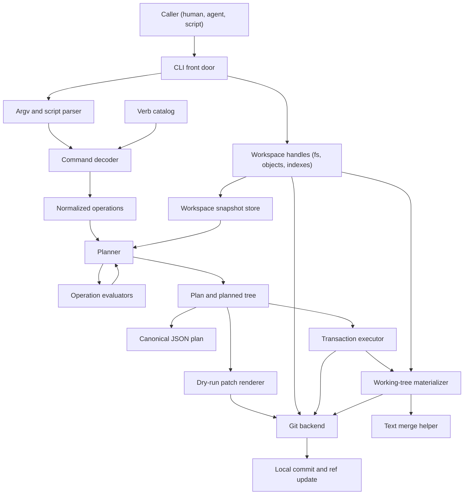

# etch — Design

> Status: v0, in progress. Captures decisions made through initial design discussion.

## 1. What etch is

A small CLI for **mechanical mutations to text and data files**, where each successful mutating invocation becomes a git commit by default. Operations are atomic (per op) and transactional (per invocation): all the operations in one mutating invocation either land as a single commit or none of them do.

The primary audience is agentic coding tools operating against git-backed wiki-style repositories — multiple agents and humans iterating forward, where git history is the transaction log and mechanical edits ("set this frontmatter field," "replace this markdown section," "delete this JSON key") are common enough that doing them through a general-purpose patch tool risks subtle errors. etch trades generality for precision: it knows about a small, fixed set of file formats and a small, fixed set of operations, and it turns them into correct, atomic, reviewable commits.

The strongest value proposition is reliability, not shorter command spelling. etch should reduce hallucinated diffs, off-by-one line edits, quoting mistakes, partial writes, accidental same-file capture, and hard-to-review patches. Token and time savings come from fewer reads, tool calls, failed patches, and repair turns, not just shorter utterances.

The headline product is a binary. There may eventually be a Go library underneath suitable for embedding; that question is deferred.

## 2. Mental model

Four principles:

1. **Commits are the contract for mutating verbs.** A successful mutating etch invocation produces a commit unless every operation is an idempotent no-op. Recording the mutation in git history is the point.

2. **The script line and the CLI argv are the same thing.** A line in an etch script is the same tokens you'd type at the shell, modulo the binary name. This symmetry is the primary ergonomic property. It means agents can prototype on the command line and concatenate script files without translation, and it means the help page documents both surfaces simultaneously.

3. **No escape hatches inside the DSL.** The script syntax has no variables, no expansions, no subshells, no pipes, no conditionals. Composition happens at the shell level, *outside* etch. This keeps etch's own blast radius statically bounded and makes it a narrow permission target.

4. **Worse is better.** etch should prefer simple implementation, clear behavior, and debuggable failure modes over completeness or clever edge-case handling. If an edge case would require disproportionate hidden machinery, prefer a clear refusal, good stderr, and recovery help. When the spec seems to demand complex machinery, revisit the product requirement before implementing it.

## 3. Invocation surface

Verb-first, with a small set of top-level flags.

```
etch <verb> [args...]                  one-shot
etch run <script>                      multi-op transaction from script
etch --plan <verb> [args...]           emit JSON plan, do not execute
etch --plan run <script>               emit JSON plan for batch
etch --dry-run <verb> [args...]        emit git-am-compatible patch
etch help [verb]                       human-readable help
etch verbs --json                      machine-readable verb catalog
etch --help                            terse one-screen reference
etch version                           version and build information
etch --version                         version and build information
```

For `run`, `<script>` is a path to an etch script. The conventional path `-` means stdin.

Top-level flags:

| Flag | Env | Effect |
|---|---|---|
| `--plan` | — | Emit JSON plan to stdout, do not write or commit. |
| `--dry-run` | — | Emit git-am-compatible patch to stdout, do not write or commit. |
| `--no-checkout` | — | After committing, do not materialize touched paths into the working tree. |
| `--untracked` | — | Permit target paths under CWD that are not tracked by git. |
| `--message <m>` | — | Override auto-generated commit message. |
| `--subject-prefix <s>` | — | Prepend literal text to the auto-generated subject line. |
| `--subject-suffix <s>` | — | Append literal text to the auto-generated subject line. |
| `--body-prefix <s>` | — | Prepend a body block before the auto-generated body. |
| `--body-suffix <s>` | — | Append a body block after the auto-generated body. |
| `--retries <n>` | — | Retry budget on optimistic-concurrency conflict. `0` disables retries. Default `3`. |
| `--allow-empty` | — | Permit a commit with no content change when at least one mutating command was supplied. |
| `--version` | — | Alias for `etch version`. |

`--plan` and `--dry-run` are mutually exclusive and skip execution entirely. `--no-checkout` applies only to successful committing invocations; with `--plan` or `--dry-run` it is accepted and ignored. `--message` is mutually exclusive with subject/body message modifiers; subject and body modifiers may be combined with each other.

Introspection commands that do not evaluate a verb or script do not require CWD to be inside a git worktree and do not read repository state unless their own help says otherwise. This includes `--help`, `help`, `version`, `--version`, and `verbs --json`.

All file path operands are resolved against CWD, not the repository root. Paths must be relative lexical paths, must not contain any `..` segment before normalization, must not contain `.git` as a path segment, and must not escape CWD through symlinks. Mutating invocations require CWD to be inside a git worktree. By default, source and existing target paths must already be tracked by git; `create`, `copy`, and `move` destinations may be new in the transaction base and become tracked when the invocation commits. Checkout-only files at those destination paths are handled during materialization, not planning. `--untracked` permits other untracked paths under CWD to participate in the transaction; those paths become tracked if the invocation commits. There is no non-git pure working-tree mutator mode in MVP.

There is no `-C`, `--cwd`, repo-root mode, script-local root, root directive, or environment-variable root override in MVP. Callers choose etch's capability boundary by choosing the process CWD. A future `-C`-style option can be added as opt-in behavior without changing the meaning of existing commands: path operands would still resolve against the effective CWD, and top-level flag parsing would still stop before verb operands so values beginning with `-` remain legal etch arguments.

Symlinks are resolved before tracked-path checks. A path that traverses a symlink to a target still under CWD is allowed. Structured content mutations follow a final symlink and use the resolved target path as the canonical operation path, so they operate on and commit the target file rather than the symlink object. File-level operations keep directory-entry semantics: `delete`, `move`, and `copy` of a symlink path affect or copy the symlink entry itself, while parent-directory symlinks must still resolve under CWD. Symlink loops, broken symlinks for existing-source operations, and symlink escapes are errors.

etch assumes supported structured formats are UTF-8 text. A leading UTF-8 BOM is accepted for JSON, JSONL/NDJSON, YAML, Markdown, and CSV inputs, ignored for parsing, and preserved when etch writes the file back. etch does not sniff or transcode UTF-16, Latin-1, or locale-dependent encodings; invalid UTF-8 in a structured target is an operation failure before semantic evaluation. File-level `copy`, `move`, and `delete` operate on bytes, but `create`/`replace` content and all format-aware mutations require valid UTF-8 when the target is a text format.

The memory model is whole-file for touched paths. etch reads each touched file into memory, computes full before/after byte slices, and writes full blobs into the planned tree; it does not promise streaming edits. The spec does not impose an artificial file-size limit. Resource exhaustion is an operation failure; implementations should report it cleanly when detected rather than partially executing a transaction.

## 4. Script syntax

A script is a sequence of lines. Each line is either blank, a comment (starts with `#`), or a statement. A statement is the same token sequence that follows `etch` on the command line, tokenized using shell single-quote, double-quote, and backslash-escape rules. There are no expansions of any kind — `$FOO` is a literal four-character string.

Multi-line values use `<<DELIM` heredocs shaped like shell heredocs, but heredocs are an etch-level construct (not delegated to a shell parser) and are the only multi-line affordance:

```
# Set a frontmatter scalar
set posts/hello.md title "Hello, world"

# JSON value as a single argument
set posts/hello.md tags --json '["draft","intro"]'

# Multiple field assignments in one file
set cache/state.json last_ingestion=2026-05-02 count:=12

# Multi-line content via heredoc
section replace posts/hello.md "## Summary" <<EOF
This post introduces the project and its goals.
EOF

# Delete a key
delete posts/hello.md draft
```

Heredoc values begin with an opener token written as `<<DELIM`, where `DELIM` is a nonempty caller-chosen delimiter. The delimiter may use the normal statement tokenizer's quote and backslash rules inside the opener; after quote removal, `<<EOF` and `<<"EOF"` are equivalent. The value continues until a physical line whose contents exactly equal the delimiter; that terminator line is not part of the value. If the content needs to contain `EOF` or any other delimiter on a line by itself, the caller chooses a different delimiter. Heredoc bodies are literal text: no variable expansion, command substitution, backslash processing, or indentation trimming occurs. A missing terminator is a usage error.

`run` errors include script source location so generated scripts are repairable. File-backed scripts report `etch: <script>:<line>: <message>`. `run -` reports `etch: <stdin>:<line>: <message>`. The line is the first physical line of the statement, including a heredoc opener for multi-line values. Direct argv errors omit source location and use `etch: <message>`.

Statement shapes are regular, but not literally fixed at three arguments. The common mutating shape is `verb path selector value`; file verbs may have two paths; plumbing commands add a format namespace before the verb. Where a command needs additional knobs, they are flags (`--depth=2`), not positional surprises. If a command cannot be summarized compactly in the help table, the command is wrong.

### Why this and not the alternatives

A decision matrix considered six options against ten criteria (LLM correctness, CLI/script symmetry, multi-line value ergonomics, parse error locality, implementation surface, quoting pit count, shell composability, familiarity, doc density, auditability). The chosen option (shell-quoted argv lines) scored highest by a wide margin. The two key disqualifiers for embedded shell (e.g., via `mvdan/sh`) were:

- **Auditability.** Embedded shell has command substitution and expansion, so a static enumeration of "what will this script do" requires evaluation, and even then can reach outside the etch operation set entirely. That breaks the authorization story.
- **Quoting pit count.** Inheriting shell's expansion rules means inheriting its quoting traps, which are the #1 LLM failure mode in scripted-tool tasks.

JSON, S-expression, Tcl-like, and bespoke-DSL alternatives were ruled out (CLI/script asymmetry, familiarity cost, or implementation overhead with no offsetting benefit).

## 5. Verbs

Two tiers:

Global flags apply to invocation execution and must appear before the command path. Porcelain verbs infer file format from path extension (`.md` → markdown-with-optional-frontmatter, `.json` → JSON, `.jsonl`/`.ndjson` → newline-delimited JSON, `.yaml`/`.yml` → YAML, `.csv` → CSV). They cover the common cases and are what most scripts use. A porcelain command may have format-specific operands after the path; the decoder resolves the command prefix, reads the path, infers the format, and then validates the resolved operand schema.

**Plumbing** commands are format-explicit subcommands (`json set`, `jsonl append`, `yaml set`, `frontmatter set`, `md section replace`). They have no inference and no surprises, suitable for scripts where the file extension might lie or where the porcelain heuristics would pick the wrong format.

The MVP verb surface is constrained by §3 (regular command shapes) and §10 (must fit in a dense help page). The committed MVP verb surface is mutating operations plus transaction guards: mutating verbs compute new file contents, and guards assert preconditions before those contents flow through the plan/commit/materialization pipeline.

Query/read verbs are out of scope for MVP.

### Selector syntax

Structured data selectors are paths, not programs. For JSON, YAML, and YAML frontmatter, etch selectors are a subset of RFC 9535 JSONPath singular queries: they can identify at most one node and exclude wildcards, recursive descent, slices, filters, unions, and function extensions. This gives etch a standard selector grammar without importing JSONPath's full query language.

- `$.agents.assistant.last_run` for ordinary object fields.
- `$.items[0].title` for array indexes.
- `$["key.with.dots"]` for keys that cannot be represented as plain dotted segments.

The MVP selector subset admits only the root `$`, dot shorthand for simple member names, bracket-quoted member names using RFC 9535 string escaping, and non-negative integer array indexes. It rejects negative indexes, wildcards, recursive descent, slices, filters, unions, and function extensions. CLI selector operands may be written either in canonical JSONPath form (`$.a.b`, `$["key.with.dots"]`) or in relative shorthand without the root (`a.b`, `["key.with.dots"]`); relative shorthand is normalized by prepending `$`, so `set file.json a.b.c value` targets `$.a.b.c`. Canonical plans always store the rooted form in a deterministic spelling: dot shorthand where valid, bracket-quoted member names where needed, and `[N]` for array indexes.

Verbs treat a zero-match selector according to the verb. `set` may create missing object containers and missing final object members; for array indexes, it may update an existing element or append only when the index equals the array length. `append` and `add` may create a missing final array under the same object-container rules, but they do not create arrays through indexed paths or fill array holes. `delete` and `remove` are idempotent for missing leaves. Any verb fails if an intermediate component exists with the wrong shape. Syntax that can produce multiple matches is rejected before evaluation.

JSON Pointer was considered because it is standardized and unambiguous, but `/agents/assistant/last_run` is less natural at the CLI and composes poorly with Markdown part selectors. Full JSONPath was considered because it is standardized and familiar, but wildcard/predicate/multi-match behavior is the wrong default for single-target mutation. Full `jq` was considered because its path syntax is good, but its execution model is far broader than etch's mutation contract.

### Markdown parts

Markdown files have several addressable parts: YAML frontmatter, section bodies, task/list items, pipe tables, and Obsidian Dataview-style inline fields. For porcelain structured commands on Markdown paths, a bare selector targets YAML frontmatter by default. `set task.md status complete` means "within this Markdown file, mutate the YAML frontmatter field `status`." The structured selector inside that part is still normalized as JSONPath (`$.status`) in plans.

The MVP `frontmatter.*` porcelain selector namespace has been removed. `set task.md frontmatter.status complete` is a usage error; callers should write `set task.md status complete` or use the format-explicit plumbing command `frontmatter set task.md status complete`. The Dataview implicit namespace `file.*` is reserved and is not writable through porcelain Markdown field mutation.

Markdown address flags switch `set` and `delete` from frontmatter to body-local Dataview inline fields. `set task.md done 2026-05-02 --task "Send follow-up"` creates or updates `[done:: 2026-05-02]` on the uniquely addressed task. `set note.md last 2026-05-02 --body` creates or updates a page-level body field. Full-line fields, bracketed fields, and parenthesized fields are recognized outside code and HTML blocks; updates preserve the existing source form, field spelling, whitespace around `::`, and surrounding Markdown.

Alternatives considered:

- **Explicit frontmatter namespace.** `set task.md frontmatter.status complete` is clear but too noisy for the common case and made frontmatter feel unlike other structured files.
- **Separate porcelain verbs only.** `frontmatter set task.md status complete` is explicit but loses the convenient format-inferred `set path selector value` shape.
- **Virtual YAML file model.** Treat frontmatter as a hidden YAML document adjacent to the Markdown body. Accurate internally, but awkward to explain at the CLI.

The resulting rule: frontmatter is the default structured location for Markdown paths, while body-local fields require Markdown address flags. Canonical plans store the Markdown part and normalized structured selector separately. Plumbing commands can use namespaces instead (`frontmatter set <path> <selector> <value>`), where `<selector>` is already relative to that part and may still be written with or without the leading `$`.

Markdown body operations share one addressing model. Section selectors accept either a title such as `Status` or an ATX heading such as `## Status`; title-only selectors search all ATX heading levels, ATX selectors include the level, closing `#` markers are ignored, and repeated matches are ambiguity errors. List-item selectors normalize away the list marker, task checkbox, surrounding whitespace, Dataview inline field annotations, and numeric trailing reference-annotation links, then compare rendered inline Markdown text. Item filters are `task`, `plain`, `numbered`, and `bullet`; repeated filters combine across independent axes, while contradictions such as `task` with `plain` fail before planning. Placement selectors use `head`, `tail`, `before`, or `after` as one mutually exclusive insertion point when a command accepts caller-selected placement.

### Mutating surface

| Format | Verbs | Selector/value behavior |
|---|---|---|
| JSON | `set`, `delete`, `append`, `add`, `remove` | Selectors use the JSONPath subset above. Values are strings by default. `--json <value>` or `<value> --json` parses one value token as a strict JSON value; JavaScript object-literal shorthand is intentionally not accepted. `set` also accepts field assignment items, where `selector=value` writes a string and `selector:=json` writes strict JSON. Assignment items are not accepted by `append`, `add`, `remove`, or `delete`. `set` creates missing object containers, creates missing final object members, updates existing array elements, and appends to an array only when the selected index equals the array length. `delete` removes an existing member or array element and is a no-op when the final target is absent. `append` appends the value to an array, creating a missing final array under object-container rules. `add` ensures an array contains the value, appending only if no structurally equal value is present. `remove` ensures an array does not contain the value, removing all structurally equal occurrences and doing nothing when the final target is absent. |
| JSONL/NDJSON | `append` | JSONL append has no selector. The value operand is always strict JSON and is rendered as one compact JSON value followed by `\n`, preserving object member order from the operand. `.jsonl` and `.ndjson` paths infer this adapter for porcelain `append`; `jsonl append <path> <json-value>` is the format-explicit plumbing form. Missing JSONL targets are treated as empty logs and created. Non-empty targets must end with a newline, and the tail record boundary must not be blank. Existing records are not parsed during append. The operation is non-idempotent; retries after failed ref-CAS replan against the new `HEAD`, but successful repeated invocations append repeated records. |
| YAML | `set`, `delete`, `append`, `add`, `remove` | Same selector and value semantics as JSON, but using a round-tripping YAML representation so comments, key order, indentation style, anchors, aliases, and scalar spelling are preserved where the parser can preserve them. Empty files and empty root collections produce block-style output when content is added. JSON object operands preserve member order when materialized as YAML mappings. |
| Markdown frontmatter | `set`, `delete`, `append`, `add`, `remove` | For Markdown paths, bare structured selectors operate on YAML frontmatter using the YAML rules above. If a Markdown file has no frontmatter, `set`, `append`, and `add` can create a frontmatter block, separated from an existing Markdown body by a blank line; `delete` and `remove` are no-ops when the final target is absent. The old porcelain `frontmatter.*` namespace is rejected; use bare selectors or `frontmatter ...` plumbing. |
| Markdown inline fields | `set`, `delete` | Markdown address flags such as `--body`, `--section`, `--item`, and `--task` switch `set` and `delete` from frontmatter to Dataview-style inline fields in the Markdown body. Existing fields match first by exact raw source field name, then by Dataview-normalized field name if the normalized match is unique. Creating page-level or section-level fields uses full-line syntax; creating item-local fields uses bracketed syntax, or parenthesized syntax with `--hidden`. Dataview implicit fields such as `file.name`, task `status`, and task `text` are not writable through this surface. |
| Markdown body | `section replace`, `section append`, `section prepend` | The selector is a heading title such as `Notes` or heading line such as `## Notes`. Matching covers the content under that heading up to the next heading of equal or higher level. Missing or ambiguous headings are errors. Section content is a Markdown block fragment with boundary blank lines trimmed from the operand and line endings normalized to the file style. `section replace` preserves existing blank-line boundaries between the heading and body, and between the body and following heading, when those boundaries are present. `section append` and `section prepend` insert block fragments with deterministic one-blank-line boundaries for non-empty sections. |
| Markdown tasks/lists | `task open`, `task close`, `task add`, `list add` | Task/list commands use exact source-normalized item text plus optional Markdown address flags such as `--section`, `--before`, and `--after`; `--before` and `--after` match list items, not arbitrary prose. `task close` changes `[ ]` to `[x]` and does not create missing tasks. `task open` ensures an open task: it no-ops for `[ ]`, changes `[x]` or `[X]` to `[ ]`, and creates `- [ ] <text>` only when a destination address is supplied. Custom checkbox statuses fail. `list add` and `task add` construct list item source from plain item text, rejecting multiline text and text that already includes a Markdown list marker. Existing list marker style is reused when inserting into a list; otherwise new list items default to `-`. |
| Tables | `table set`, `table row append`, `table row insert`, `table row delete`, `table column add`, `table column rename`, `table column delete` | Table commands infer Markdown pipe tables or CSV tables from the path. Markdown operands include a scope and optional table ordinal; CSV operands omit them because a CSV file is one table. Format-explicit plumbing commands are available as `md table ...` and `csv ...`. |
| Files | `create`, `replace`, `delete`, `move`, `copy` | File-level verbs use explicit etch names rather than shell primitive names. Signatures are `create <path> <content>`, `replace <path> <content>`, `delete <path>`, `move <src> <dst>`, and `copy <src> <dst>`. `create` creates missing paths, no-ops when an existing path already has the same content, and fails if an existing path has different content. When content is omitted, JSON files default to `{}` and other paths default to empty content. `replace` requires an existing regular file and ensures its entire content equals the supplied content. `copy` fails if the destination exists in the transaction base. `delete` is idempotent when the path is absent from the transaction base. `move` fails if the source is absent or destination exists in the transaction base. |
| Transaction guards | `exists`, `missing`, `contains` | Guards have no stdout and make no content changes. They participate in the same plan and transaction as mutating operations, and the invocation aborts with exit 1 before side effects if any guard is false. |

JSON operations edit the document representation, not just a decoded data value. Duplicate object member names are accepted as source syntax so localized edits can preserve the rest of the file. A member selector chooses the first matching member in source order; setting that selected member replaces that AST node only. JSON value operands that are materialized into data values collapse duplicate object member names with last-name-wins map semantics, so callers should avoid duplicate names in value operands.

YAML and frontmatter operations edit the document representation, not the YAML graph after anchor and alias resolution. Anchors and aliases are concrete syntax. Mutating an anchored node edits that node's representation; aliases remain alias nodes and downstream YAML readers may observe the updated anchor value through normal YAML resolution. Selectors do not dereference aliases, so a selector segment below an alias is a type error. Setting an alias node replaces that alias occurrence only. MVP YAML and frontmatter selectors address the first YAML document; multi-document YAML selection is deferred. New and replaced YAML nodes are generated snippets, so touched nodes may use generated formatting while untouched surrounding representation is preserved where the parser can preserve it. Replacing an existing single- or double-quoted string preserves that quote style when the new value is also a single-line string. Generated YAML string scalars must render so they round-trip as strings; for example, setting a string value `true` writes a quoted scalar rather than a boolean-shaped scalar.

For JSON, YAML, and frontmatter `add` and `remove`, structural equality is semantic rather than byte-spelling equality within the same document-representation model. Editing the representation means etch preserves and rewrites source structure; it does not make array membership depend on superficial source spelling. Object and mapping key order, whitespace, quoting style, and numeric spelling for numeric values do not affect equality; arrays remain ordered, strings compare after decoding, and numbers compare by parsed numeric value in the accepted format domain. YAML aliases compare as alias nodes by anchor name and are not equal to the values they would resolve to. For example, `{"a":1,"b":2}` and `{"b":2,"a":1}` are equal for `add` and `remove`.

Deferred mutating operations include ordered-list `prepend` and positional `insert`; Markdown `section delete`, `section move`, and `section split`; and cross-file transforms that read from one location and write/remove/insert elsewhere. These are still mutating verbs, not queries, because their contract is new file contents rather than stdout.

### Transaction guards

Guard commands assert preconditions for the transaction. They are intentionally not query or reporting commands: they print nothing on success, return no selected values, and exist only to let scripts fail before mutation side effects occur. They are useful for catching wrong-CWD mistakes and stale assumptions in generated scripts.

```sh
etch exists <path>
etch missing <path>
etch contains <path> <literal>
```

`exists` succeeds when the path exists in the admitted input view. For tracked paths, that means the path exists in the base tree at `HEAD`; it can still pass when the working-tree copy has been deleted. With `--untracked`, an untracked working-tree path under CWD may also satisfy the guard. `missing` is the complement of `exists` in the same admitted input view: for tracked paths, absence means absent from `HEAD`; without `--untracked`, checkout-only untracked files are ignored by the guard. If a later `create`, `copy`, or `move` writes the same path, that local file is handled during materialization as an add/add conflict or clean failure, not as a guard failure. `contains` succeeds when the admitted file bytes contain the literal bytes of `<literal>` exactly. For tracked paths, those admitted bytes are the base-tree blob at `HEAD`, not the working-tree file; with `--untracked`, an admitted untracked path uses working-tree bytes. `contains` is not a regex, does not normalize line endings, and does not perform case folding. Multi-line literals use the same heredoc syntax as mutating values.

Guarded paths obey the same CWD containment, `.git` refusal, symlink, tracked/untracked, encoding, and resource rules as other path operands. A satisfied guard contributes no content change and never creates a commit by itself. A guard-only invocation whose guards all pass exits 0 with the same `nothing to do` notice as any other no-op invocation. `--allow-empty` is rejected for guard-only invocations. A failed guard exits 1 with an `etch: ...` message that names the failed guard.

Guards are included in canonical plans and plan hashes. Files read only by guards are part of the input set; if they are not otherwise changed, their before/after hashes are identical in the plan. Dry-run output includes satisfied guards as checks, not as patch hunks.

### Table model

Tables are ordered rows and named columns of string cells. Markdown pipe tables and CSV use the same logical model. Markdown `table set` patches addressed cell source directly when those cells have source spans. Structural Markdown table operations may re-render the addressed table. Markdown table rewrites preserve surrounding Markdown bytes.

Porcelain table commands infer Markdown or CSV from `<path>`.

For Markdown paths, the command shape includes a document/table scope:

```sh
etch table set <path> <scope> [<table>] <range> <value>
etch table row append <path> <scope> [<table>] <row-json>
etch table row insert <path> <scope> [<table>] (--before <row> | --after <row>) <row-json>
etch table row delete <path> <scope> [<table>] <row>
etch table column add <path> <scope> [<table>] <column> [--after <column>] [--default <value>]
etch table column rename <path> <scope> [<table>] <old-column> <new-column>
etch table column delete <path> <scope> [<table>] <column>
```

For CSV paths, the command shape omits scope and table because a CSV file is inherently one table:

```sh
etch table set <path> <range> <value>
etch table row append <path> <row-json>
etch table row insert <path> (--before <row> | --after <row>) <row-json>
etch table row delete <path> <row>
etch table column add <path> <column> [--after <column>] [--default <value>]
etch table column rename <path> <old-column> <new-column>
etch table column delete <path> <column>
```

Format-explicit plumbing is still available when inference is undesirable:

```sh
etch md table set <path> <scope> [<table>] <range> <value>
etch md table row append <path> <scope> [<table>] <row-json>
etch md table row insert <path> <scope> [<table>] (--before <row> | --after <row>) <row-json>
etch md table row delete <path> <scope> [<table>] <row>
etch md table column add <path> <scope> [<table>] <column> [--after <column>] [--default <value>]
etch md table column rename <path> <scope> [<table>] <old-column> <new-column>
etch md table column delete <path> <scope> [<table>] <column>
etch csv set <path> <range> <value>
etch csv row append <path> <row-json>
etch csv row insert <path> (--before <row> | --after <row>) <row-json>
etch csv row delete <path> <row>
etch csv column add <path> <column> [--after <column>] [--default <value>]
etch csv column rename <path> <old-column> <new-column>
etch csv column delete <path> <column>
```

`<scope>` is either `doc` for the whole Markdown document or an exact ATX heading selector such as `## Inventory`. `<table>` is an ordinal like `@0` or `@1`, resolved within the selected scope. The table ordinal may be omitted only when the scope contains exactly one table. Canonical plans store the resolved format, resolved scope when applicable, and table ordinal when applicable.

Table ranges have the shape `<rows>,<columns>`. Rows may be `all`, a zero-based ordinal (`@0`), an inclusive ordinal range (`@2..@5`), or an exact key match such as `sku=ABC-123` or `[SKU Code]="ABC 123"`. Key matches compare the normalized text in the named column and must identify exactly one row. Columns may be `all`, a zero-based ordinal (`@2`), an inclusive ordinal range (`@1..@3`), an exact header label (`status`), a bracketed header label (`[Due Date]`), or an inclusive header range (`[Sales Amount]..[Commission Amount]`). Bracketed labels are required when a row key or column label contains spaces or selector punctuation. `table set` assigns the string value to every selected cell in the rectangular range.

Structural row commands take a single row selector, not a full range. `row delete` accepts `all`, an ordinal, an ordinal range, or a key match. `row insert --before/--after` requires a single ordinal or key match. Structural column commands take single column selectors except where a later command explicitly admits ranges. `column add` no-ops when the named column already exists, and `column delete` no-ops when the named column is absent.

`row-json` is a strict JSON object keyed by column label. Missing columns become empty cells; unknown columns are errors. Table cells are strings in MVP, so structured JSON values in `row-json` are rejected unless a later table value model admits them.

Table operations do not include formulas, type inference, sorting, joins, arbitrary predicates, or dataframe-style transforms. They are basic datagrid mutations over an addressed table.

### Markdown conventions to design early

Markdown is not just prose in the target repositories. The early Markdown surface needs explicit conventions for:

- **Sections.** ATX headings are stable anchors. Section selectors should support exact heading text first, then consider disambiguators for repeated headings.
- **Tasks.** GitHub-style task list items (`- [ ]` / `- [x]`) need verbs for completion and metadata updates. Candidate commands: `task complete <path> <task-selector>` and `task set <path> <task-selector> <field> <value>`.
- **Inline fields.** Obsidian Dataview-style fields such as `[due:: 2026-03-01]` should be considered first-class Markdown data. Candidate commands: `field set <path> <field-selector> <value>`, `field delete <path> <field-selector>`, and `field get <path> <field-selector>`.

Tasks and inline fields need a separate selector design pass before they graduate into the MVP table above.

Each command is annotated by class in the help table: `guard`, `idempotent`, or `non-idempotent`. `idempotent` and `non-idempotent` commands are mutating commands. Idempotency describes content-change behavior within a transaction base, not whether the same command can be safely re-run after a successful commit against a new base. Idempotent commands that produce no content change are no-ops and don't contribute to the commit; non-idempotent commands (`append`) always produce changes. Guards make no content change and only preserve or reject the admitted input state.

## 6. Plans

A **plan** is etch's structured answer to "if I were to run this mutating invocation, what exactly would happen — every byte that would change in `HEAD`, in what file, ending in which commit?" It is produced by the same code path as actual execution, stopped one step before side effects. Same parser, same operation evaluator, same commit-tree builder — everything except writing objects, updating the ref, and materializing touched paths into the checkout. The plan cannot drift from reality because it *is* reality minus the side effects.

Plans are computed from the base commit, not from dirty checkout bytes. The planned tree is therefore a clean descendant of `HEAD` containing only etch's structural mutation. Staged and unstaged checkout edits are treated as concurrent local state during materialization, not as implicit inputs to the commit.

The canonical plan format is JSON. It is the machine contract for hashing, authorization caches, tests, and host integrations. It should not be replaced by a prose or email-shaped format, because plan identity depends on stable parsing, canonicalization, and schema evolution. Value-bearing structured operations include their value type in the plan, and value hashes include that type, so a string `12` and a JSON number `12` are distinct plans.

Human preview is a separate surface. `--dry-run` lowers the semantic JSON plan to a base-locked mailbox patch compatible with `git am`, following `git format-patch` conventions: metadata headers, commit-message block, a three-dash separator, diffstat, and patch hunks. It is optimized for review and mechanical replay, not for canonical plan identity.

### Plan contents

```json
{
  "$schema": "https://brandonbloom.github.io/etch/schemas/2026-04/plan.schema.json",
  "ref": "refs/heads/main",
  "base_commit": "a1b2c3...",
  "operations": [
    {
      "verb": "set",
      "target": {
        "path": "posts/hello.md",
        "part": "frontmatter",
        "selector": "$.title"
      },
      "value_type": "string",
      "value_sha256": "5d41402a..."
    },
    {
      "verb": "section replace",
      "target": {
        "path": "posts/hello.md",
        "part": "body",
        "section": "## Summary"
      },
      "value_sha256": "9f86d081..."
    }
  ],
  "files": {
    "posts/hello.md": {
      "before_sha256": "e3b0c442...",
      "after_sha256": "84983e44..."
    }
  },
  "tree": "7f4e8d...",
  "commit": {
    "message": "etch: 2 changes in posts/hello.md\n\nChanges:\n- set posts/hello.md title \"Hello, world\"\n- section replace posts/hello.md \"## Summary\" \"A tighter summary.\""
  }
}
```

All operation values are stored as `value_sha256` (no inline values) for uniformity and small plan size. Commit messages may contain bounded value previews, but the actual content is recoverable from the file's before/after states when needed for display.

### Dry-run preview

`--dry-run` renders the plan as a reviewable patch message rather than canonical JSON. It is a lowered artifact: applying it replays the already-computed byte-level change against the planned base, but it does not re-run etch's semantic selectors, validation, retries, or materialization logic.

The output follows `git am`'s mailbox conventions:

- The first `From <oid> Mon Sep 17 00:00:00 2001` line is the mbox delimiter, not commit metadata. etch uses the zero object ID there, following `git format-patch --zero-commit`; plan identity lives in `Etch-Plan-Hash`.
- The mail `Subject:` is the commit-message subject. etch should not wrap it in `[PATCH]` or `[ETCH PLAN]`, because `git am` strips common `[PATCH ...]` prefixes.
- The body before the first three-dash line (`---`), `diff -`, or `Index:` line becomes the commit-message body.
- Everything after the first three-dash line is patch input or patch commentary, not commit-message text.
- `Etch-*` lines live in the mail header block. They are for etch-aware readers, not commit-message trailers, and should not appear in `git log`.
- The `From:` and `Date:` mail headers carry the planned author identity and author date for `git am`.
- The applying committer identity and committer date come from the `git am` environment and options, so `git am` compatibility promises the same tree, commit message, and author metadata, not the same commit OID.

When a planned change can be represented as a Git patch, `--dry-run` output should be compatible with `git am`. The exact text is not part of the plan hash, but it should be stable enough for snapshot tests and easy human review:

```text
From 0000000000000000000000000000000000000000 Mon Sep 17 00:00:00 2001
From: <author-name> <author-email>
Date: <author-date>
Subject: etch set posts/hello.md title "Hello, world"
Etch-Plan-Hash: sha256:<hex>
Etch-Base-Commit: a1b2c3...
Etch-Tree: 7f4e8d...

---
 posts/hello.md | 2 +-
 1 file changed, 1 insertion(+), 1 deletion(-)

diff --git a/posts/hello.md b/posts/hello.md
...
```

The commit-message portion before `---` is exactly the generated commit message from §8. A multi-op plan's `Changes:` body therefore appears before `---`. After `---`, etch emits the diffstat and patch hunks. It does not embed the original command or script in the dry-run output; the generated commit message plus the patch hunks are the review surface, and the JSON plan is the canonical semantic record.

For a multi-op `run`, the generated commit body appears before `---`:

```text
From 0000000000000000000000000000000000000000 Mon Sep 17 00:00:00 2001
From: <author-name> <author-email>
Date: <author-date>
Subject: etch: 2 changes in posts/hello.md
Etch-Plan-Hash: sha256:<hex>
Etch-Base-Commit: a1b2c3...
Etch-Tree: 7f4e8d...

Changes:
- set posts/hello.md title "Hello, world"
- section replace posts/hello.md "## Summary" "A tighter summary."

---
 posts/hello.md | 6 +++---

diff --git a/posts/hello.md b/posts/hello.md
...
```

If a future operation cannot be represented as a `git am`-compatible patch, `--dry-run` must either report that limitation or use an explicitly different format marker. Silent fallback to a non-applicable lookalike is not allowed.

### Canonicalization & hashing

Plans are serialized using JCS (RFC 8785): sorted keys, no whitespace, escaped consistently. The plan hash is SHA-256 of the canonical bytes. Two implementations of the canonicalizer agree byte-for-byte.

The `$schema` key identifies the canonical plan schema and includes a CalVer path segment. The schema URI is part of the canonical bytes and therefore part of the plan hash; etch does not fetch it while planning. etch releases that emit the same schema URI must preserve byte-compatible plan semantics for the same invocation and repository state. If a future release emits a new schema URI, cached approvals for the old schema do not authorize the new plan; hosts must recompute, render, and approve the new plan bytes. Implementations must reject unsupported schema URIs rather than attempting lossy conversion.

### What's in the hash, and why

- **Operations** anchor to user intent.
- **Per-file before/after sha256** anchors to both base-tree input state and computed output. A change in etch's *behavior* (a verb's semantics changed across versions) invalidates plans even when operations look textually identical, because the after-hashes differ. This means a runtime caching "I approved hash H" doesn't also need to track etch versions.
- **Base commit** pins to a point in history; if HEAD has moved, the plan is stale.
- **Tree OID** is the strongest possible "what would actually land" anchor — two plans with the same tree OID produce byte-identical commits.
- **Commit metadata** captures message and author. Author/timestamp are normalized during planning unless `GIT_AUTHOR_DATE`/`GIT_COMMITTER_DATE` are set.

### Plans drive both audit and execution

A plan serves three purposes from one structure:

1. **Audit record** for runtimes rendering "here's what will happen" to humans.
2. **Auth-cache key.** Hash a plan, cache the user's approval against the hash; reuse approval iff the same plan recomputes to the same hash.
3. **STM transaction record.** See §7.

## 7. Execution model & concurrency

etch executes optimistically and uses git's existing CAS primitives to detect conflict.

MVP execution targets the current checkout only. There is no `--ref` flag. On a branch, etch updates the checked-out branch ref with old-value CAS. In detached `HEAD`, etch creates a normal child commit and updates `HEAD` directly with old-value CAS. Editing non-checked-out refs is deferred until there is a concrete wiki-transaction use case.

### HEAD-sourced commits

etch computes commits from the base tree at `HEAD`, not from the caller's live index or working tree. For tracked paths, operation evaluators receive bytes from `HEAD^{tree}`. The resulting commit contains only etch's structural mutation relative to that base tree. Uncommitted human or agent edits in touched files are intentionally modeled as concurrent checkout state and are reconciled after the ref update.

This is a core safety property. etch must not accidentally sweep half-finished prose, staged experiments, or unrelated same-file edits into the commit just because they were present in the working tree. Dirty checkout state can still conflict with etch's change, but the conflict belongs in the working tree during materialization, not in the committed tree.

This differs from ordinary file-reading tools. `cat`, `grep`, editors, and most agent read tools inspect the working tree; etch mutates tracked paths from `HEAD`. If an agent's decision depends on the same bytes etch will mutate, it should read the base tree through git or encode the assumption with guard verbs. A dirty checkout can otherwise mean etch applies a correct mutation to tracked bytes the agent did not just inspect.

For `--untracked` source paths that do not exist in `HEAD`, the working-tree bytes are the only possible input and are recorded in the input set. Created destinations and copied/moved destinations that are absent from `HEAD` are still planned as additions to the base tree.

### Per-transaction temp index

Every mutating invocation creates a temp index (`GIT_INDEX_FILE` set to a tempfile) initialized from `HEAD^{tree}` (or the empty tree for an unborn branch), not by copying the user's live index. etch writes candidate blobs for touched paths into that temp index, builds a tree, creates the commit object, and updates the ref. The user's live index is never used to build the transaction, and staged or unstaged checkout changes are invisible to commit construction.

### Working-tree materialization

After a successful ref update, etch materializes touched paths into the caller's working tree by default. Materialization is a checkout synchronization phase, not part of commit construction. Its job is to rebase the caller's live index and working tree for touched paths from old `HEAD` onto new `HEAD` while preserving unrelated paths.

`--no-checkout` skips this phase. It is useful for agent workflows that care only about the commit graph and do not need the shared checkout to reflect the new commit immediately.

Because `--no-checkout` intentionally leaves touched working-tree files and live index entries unsynchronized with `HEAD`, a successful invocation using it must report the skipped synchronization on stderr:

```text
etch: committed 7f4e8d9; checkout skipped by --no-checkout
etch: working tree and index were not updated for touched paths
```

Agents using `--no-checkout` repeatedly are responsible for refreshing, comparing, or discarding checkout state before relying on local files. This is explicit divergence mode, not a materialization failure.

For each touched path, materialization considers three layers captured immediately before checkout synchronization:

- **base:** the old `HEAD` path state used for planning;
- **index:** the caller's live index path state before materialization;
- **worktree:** the caller's working-tree path state before materialization.

A mergeable path state is either absent or regular-file bytes. Absence is a first-class state, so the same materialization machinery covers creates, deletes, copies, and moves. Symlink entries, directory/file conflicts, and other non-regular states are handled only where the file-level verb explicitly targets the directory entry; otherwise they are unmergeable materialization states.

Binary classification matters only when materialization needs a text merge or conflict markers. Clean checkout-style materialization may copy, create, delete, or move arbitrary regular-file bytes. A materialization merge is text-mergeable only when every non-absent regular-file state in that merge is valid UTF-8 and contains no NUL byte. Anything else is binary/unmergeable for MVP, regardless of file extension or Git's diff heuristics.

MVP materialization assumes simple Git text checkouts: blob, index, and working-tree bytes for touched text paths are comparable without configured checkout conversion. Repositories intended for etch should keep touched structured files as normalized UTF-8 text with LF line endings and no per-path filters. etch does not emulate Git's full checkout conversion stack, including `.gitattributes` text/eol rules, `core.autocrlf`, `working-tree-encoding`, or clean/smudge/process filters. If a touched path appears to require such conversion for safe materialization, etch fails cleanly after the commit rather than hiding that complexity in the implementation or overwriting the local file.

If both index and worktree match base, materialization is an ordinary checkout of the new `HEAD` path state into both the live index and working tree. If either layer differs, etch treats that difference as concurrent local work and performs text three-way merges:

1. Rebase the live index layer with `base = old HEAD`, `ours = new HEAD`, and `theirs = pre-materialization index`.
2. Rebase the working-tree layer with `base = pre-materialization index`, `ours = post-materialization index`, and `theirs = pre-materialization worktree`.

Clean merges preserve staged and unstaged layers relative to the new `HEAD`: pre-existing staged changes remain staged after being rebased, and pre-existing unstaged changes remain unstaged after being rebased. If a text merge conflicts, etch writes familiar conflict markers to the working tree, leaves the path dirty, and exits 1 after the commit exists. The MVP merge engine may conservatively report a conflict for complex text edits it cannot confidently merge, even when a more complete merge algorithm could prove the edits independent. The index is not put into an unmerged multi-stage state in MVP. If an index-layer conflict cannot be represented without an unmerged index, etch writes the conflict to the working tree and leaves the live index at the new `HEAD` entry for that path, making the recovery visible rather than silently preserving a stale staged blob. For binary paths, or if text merge machinery cannot produce a usable result, etch fails cleanly without overwriting the current working-tree file.

Create, copy, and move-destination materialization use `base = absent` and `ours = new HEAD bytes`. If the local index or worktree state is absent or already equal to the new bytes, the path materializes cleanly. If local text was concurrently created with different bytes, etch writes add/add conflict markers. If either side is binary or unmergeable, etch fails cleanly without overwriting the local path.

Delete and move-source materialization use `ours = absent`. If the local index or worktree state is absent or still equal to the old `HEAD` bytes, the path materializes cleanly as absent. If local text was edited while etch deleted the path, etch writes delete/modify conflict markers; the absent side is represented by an empty conflict side and the local side contains the local text. If the local state is binary or unmergeable, etch fails cleanly without overwriting the local path. A `move` materializes as a source delete plus a destination create, so one side of the move may materialize cleanly while the other reports a conflict or clean failure.

The transaction's durability boundary is the ref update; checkout is the post-commit synchronization step. Materialization failure never rolls back the commit. Stderr must be a recovery prompt for agents:

```text
etch: committed 7f4e8d9, but materialization wrote conflicts in 2 paths
etch: HEAD was updated; the commit exists and will not be rolled back
etch: conflicted paths:
etch:   posts/a.md
etch:   data/tasks.json
etch: resolve conflict markers, then commit or discard the working-tree resolution
etch: run `etch help conflicts` for recovery steps
```

For clean failures where conflict markers were not written:

```text
etch: committed 7f4e8d9, but could not materialize 1 path
etch: HEAD was updated; the commit exists and will not be rolled back
etch: failed paths:
etch:   assets/logo.png: binary local change could not be merged
etch: working tree and index may not match HEAD for this path
etch: run `etch help conflicts` for recovery steps
```

### The two conflict checks

1. **Input validation.** The plan records `before_sha256` for every base-tree file etch read and for any admitted untracked source path. For tracked files, the base commit plus ref CAS pins the bytes; etch does not reject dirty working-tree edits to those files. For admitted untracked source paths and path facts that affect containment or source admission, etch revalidates that the input still matches the plan before committing. Checkout-only destination occupancy is not an input-validation conflict; it is handled during materialization.
2. **Ref CAS.** etch updates the ref using the old-value form (`update-ref <ref> <new> <old-expected>`), where old-expected is the plan's `base_commit`. If another writer committed to the ref between plan and execution, this fails atomically.

Both checks are necessary. Input validation prevents stale computation for non-HEAD inputs such as admitted untracked sources and path facts that affect source admission. Ref CAS prevents losing concurrent commits and pins all tracked base-tree bytes used by the plan. Working-tree and live-index changes to tracked paths, plus checkout-only destination occupancy, are not transaction conflicts; they are concurrent checkout state handled by materialization.

### Retry policy

Retry exists to make multiple agents editing the same git-backed directory converge during normal bursts of disjoint work. On a retryable conflict, etch re-plans from the latest observed state and tries again. A ref conflict means another writer committed first; this should usually converge after re-planning on the new `HEAD`. An input-validation conflict means an admitted non-HEAD input changed; etch re-plans from the new input state where that is safe. If re-planning turns the operation into a semantic failure, such as a missing selector, wrong type, or non-unique table row, etch stops with `etch: <message>` and exits 1.

Retries are bounded by `--retries` (default 3). `--retries 0` disables retries. Infinite retry is not in MVP; sustained contention should return to the caller rather than hide a hot loop.

The first retry is immediate to handle the common single-conflict case without artificial latency. The default budget uses only these retry windows:

| Retry | Sleep window |
|---|---|
| 1 | immediate |
| 2 | 50-150ms |
| 3 | 100-300ms |

Explicit higher budgets continue with capped exponential backoff so many agents do not retry in lockstep:

| Retry | Sleep window |
|---|---|
| 4 | 200-600ms |
| 5 | 400-1200ms |
| 6+ | 800-2000ms |

Exact randomization and timer mechanics are implementation details, but the default retry budget should keep ordinary contention latency under a second while still handling the common single-collision case.

### Pinned execution is deferred

Plan hashes are useful for external approval caches: a host can present a plan, remember that the user approved hash H, and later ask etch to execute only if the recomputed plan still hashes to H. That prevents a time-of-check/time-of-use gap where the approved command text is the same but the file contents, branch head, commit message, or etch behavior changed.

That said, pinned execution is not required for the standalone CLI MVP. The MVP exposes stable plan hashes but defers the execution flag (for example, `--require-plan-hash <hex>`) until there is a concrete host-runtime integration that needs it.

## 8. Commits

Every successful mutating etch invocation produces exactly one commit by default (or zero, if all operations were idempotent no-ops and `--allow-empty` was not passed). A non-committing mutation mode is deferred until etch has a concrete multi-execution transaction model.

A future multi-execution model should have two layers. The plumbing layer uses explicit transaction IDs, for example `etch tx begin`, `etch tx <id> -- <ordinary etch command...>`, `etch tx <id> -- run <script>`, `etch tx plan <id>`, `etch tx commit <id>`, and `etch tx abort <id>`. The porcelain layer provides a current transaction context, with aliases such as `etch begin`, `etch commit`, and `etch abort`; ordinary `etch set ...` and `etch run ...` commands may run inside the current transaction without rewriting the script or coloring every verb. Nested transactions should behave like savepoints: an inner commit merges into its parent transaction, and only the outer commit writes git.

The current-transaction binding mechanism is deferred. It may involve environment variables, a context file, shell/session integration, or another host-visible handle, but it must work for agent execution models where commands may not share a long-lived shell PID. Transaction IDs, crash cleanup, locking, approval pins, query integration, and storage location are all deferred design work.

This future model requires the planner to read from an abstract base snapshot, not from `HEAD` as a hard-coded global. MVP supplies `HEAD` as that snapshot for tracked paths. A multi-execution transaction would supply its accumulated virtual tree or savepoint tree instead, then commit the final tree with the same ref-CAS and materialization rules.

### Auto-generated messages

The default commit message is generated from normalized mutating-operation descriptors. These descriptors are script-shaped and may include bounded value previews for operations whose main effect is writing a value. They never include unbounded raw payloads; full values live in file contents and are represented in plans by `value_sha256`. Guards appear in plans and dry-run checks, not in commit messages.

Descriptor shape is `<verb> <path> <selector> [<value-preview>]`, adjusted for verbs without selectors or values.

Value previews are deterministic:

- Values are previewed after parsing, not from raw argv spelling. JSON/YAML/frontmatter values render as compact JSON. Markdown body text renders as a JSON string after line-ending normalization.
- Exact previews are allowed only for single-line UTF-8 values whose rendered preview is at most 80 characters.
- Longer or multi-line UTF-8 values render with `...` truncation only. For strings, the ellipsis lives inside the JSON string (`"prefix..."`). For objects and arrays, the compact JSON rendering is cut on a character boundary and ends with `...`; truncated previews are not required to be parseable JSON.
- Non-UTF-8 values render as `<binary, N bytes>`.
- Value previews should fit within 80 characters. If a descriptor would exceed 120 characters, the preview budget is reduced so the descriptor fits; if the target alone consumes the line budget, the value preview is omitted from that descriptor.
- Single-op subjects include an exact value preview only if the full subject, including subject modifiers, fits on one line within 72 characters. Otherwise the subject omits the value and the body contains `Value: <value-preview>`.
- Commit messages do not include value hashes. Hashes are plan metadata; commit-message values are human previews.

- Single op with a short value: subject only, `etch <verb> <path> <selector> <value-preview>` (e.g., `etch set posts/hello.md title "Hello, world"`).
- Single op without a value preview in the subject: subject `etch <verb> <path> <selector>`, with a body containing `Value: <value-preview>` when the operation has a value.
- Multi-op in one file: subject `etch: N changes in <path>`, with a body headed `Changes:` and one descriptor per operation.
- Multi-op across files: subject `etch: N changes across M files`, with the same `Changes:` body.

Example multi-op message:

```text
etch: 2 changes in posts/hello.md

Changes:
- set posts/hello.md title "Hello, world"
- section replace posts/hello.md "## Summary" "A tighter summary."
```

Example long-value message:

```text
etch set posts/hello.md summary

Value: "This summary is long enough that it needs a bounded preview..."
```

`--message` overrides entirely and is mutually exclusive with subject/body message modifiers. `--subject-prefix` and `--subject-suffix` are literal affixes for the first line only; etch does not insert spaces or punctuation, so callers include the exact boundary text they want, such as `--subject-prefix "feat: "`, `--subject-prefix "fixup! "`, or `--subject-suffix " [skip ci]"`. `--body-prefix` and `--body-suffix` add body blocks before and after the generated body. When a generated body and a body modifier are both present, etch joins the blocks with a blank line. If the generated message has no body, a body modifier creates one. Configurable templates are deferred.

### Idempotency and the empty-commit case

Operations that produce no content change contribute nothing to the commit. If every op is a no-op, no commit is created and etch exits 0 with a `nothing to do` notice on stderr. `--allow-empty` forces an empty commit in the rare case where this is desired, but only for invocations that include at least one mutating command.

### Checkout state of touched files

If a tracked file etch is targeting differs between `HEAD`, the index, and the working tree, `HEAD` wins for commit construction. etch reads the base-tree state, applies operations to it, and commits that result. The live index and working tree are not inputs to the committed tree. After the commit lands, default materialization rebases touched live-index and working-tree entries onto the new `HEAD` as described in §7. Other dirty files are unaffected.

Rationale: the git commit is etch's durable transaction record, so it should contain the structural mutation etch was asked to make, not incidental checkout state. Human and agent edits already present in the checkout are treated as concurrent local work; they either merge cleanly into the checkout after the ref advances or become visible conflict markers for the caller to resolve.

## 9. Security model

The threat model: an LLM-driven agent generates etch invocations. The user wants to grant blanket permission ("always allow `etch` on this repo") once, without that grant becoming equivalent to "always allow shell."

### Intrinsic capability bounds (MVP, non-negotiable)

- **No network.** etch makes no network calls.
- **No process spawning.** etch does not exec anything except git for the strict subset of operations it needs (read refs, write objects, update refs, and inspect status or attributes needed to refuse unsupported paths). MVP etch does not invoke configured clean/smudge/process filters that can run arbitrary commands.
- **CWD-scoped paths.** etch reads and writes only relative lexical paths under CWD. It rejects absolute paths, any `..` segment before normalization, `.git` path segments, and symlink escapes. Git is the transaction backend, not an expansion of path scope.
- **No DSL escape hatch.** §4 — the script syntax has no expansion, no subshells, no exec.

These properties are intended to make etch a narrow capability. They are not, by themselves, enough to claim that every host can safely allow a broad shell rule such as `etch *` or `Bash(etch:*)`.

The hard case is host permission matching. Some agents approve commands by executable name, some by shell command prefix, some by glob-like patterns, and some run commands in a sandbox rather than a command allow-list. A broad rule admits every etch flag, so etch must not hide a fundamentally different capability class behind an environment variable or a flag that changes the path root. Therefore, the security claim for MVP is:

> etch's CWD-scoped, git-backed mutation mode is designed to be safe to grant directly for a chosen working directory. `--untracked` widens tracked-path admission inside the same CWD boundary, but it does not change the path root and has no environment-variable equivalent. Blanket shell allow-list guidance is deferred until tested against the permission models of target hosts.

### Plan as authorization primitive (deferred)

A runtime can compute `etch --plan <args...>`, render the JSON to a human, hash it, cache the approval, and later execute only if the same plan would result. The execution pin is deferred, but the plan format should remain suitable for this use.

### Auth protocol on stdio (out of scope)

An interactive `AUTH-REQUEST`/`AUTH-GRANT` protocol on stdio was considered and rejected — it leaks runtime concerns into etch and competes with whatever the host runtime already does. Etch instead exposes structured exit info that runtimes can drive themselves.

## 10. Documentation surfaces

Three layers, designed so an agent can load the entire feature set in a small token budget:

| Surface | Audience | Budget |
|---|---|---|
| `etch --help` | agents that already know CLIs | ~400 tokens |
| `etch help` / `man etch` | humans, agents needing examples | ~1500 tokens |
| `etch verbs --json` | runtimes building allow-lists | machine-readable |

The verb table is the bulk of the help. It's strictly tabular: name, signature, one-line description, command class. Deviations get one line of prose, not a section. The discipline is enforced by writing the help page first when designing each verb — if it doesn't fit, the verb is wrong (§5).

Help topics mirror verbs and subcommands where that helps navigation (`etch help table`, `etch help table row`, `etch help csv`). General topics stay flat rather than becoming a hierarchy; MVP includes `etch help model`, `etch help selectors`, `etch help values`, `etch help plans`, `etch help security`, and `etch help conflicts`.

Default human help lists canonical command paths and avoids duplicate alias rows so prompt-seeding stays compact and unambiguous. Alias documentation, when aliases exist, lives behind explicit surfaces such as `etch help aliases` or an aliases section in format-specific help. `verbs --json` includes both canonical commands and aliases, with enough metadata for callers to filter to canonical commands.

## 11. Exit codes

- `0` — success.
- `1` — operation failed.
- `2` — usage error (unknown flag, malformed argv).

MVP should not allocate a large taxonomy up front. Add distinct exit codes only when callers have a distinct automated response. For example, retry-budget exhaustion may eventually deserve a separate code if callers should retry later, while "selector not found" and "target file missing" can both be ordinary operation failures for a human-facing CLI.

Errors printed to stderr use ordinary command-line style: `etch: <message>`. Script execution adds source locality as `etch: <script>:<line>: <message>` or `etch: <stdin>:<line>: <message>`. MVP does not define machine-readable error codes or a JSON error mode without a concrete integration use case.

## 12. Configuration

Environment variables:

| Var | Effect |
|---|---|
| `GIT_AUTHOR_DATE`, `GIT_COMMITTER_DATE` | Standard git semantics; used in commits and plan hashes. |
| `GIT_AUTHOR_NAME`, `GIT_AUTHOR_EMAIL` | Standard git semantics. |

No custom config file in MVP.

## 13. Non-goals

- **Generic text editing.** Use `sed`, `awk`, `sd`. etch is for *structural* mutations on known formats.
- **Querying and reporting.** MVP etch does not provide `get`, `keys`, listing, search, value-returning, or report-style commands. Transaction guards may fail a mutation transaction, but they do not print results or return selected values. Use native file-read tools, shell tools, or a future query design outside the MVP mutation surface.
- **Multi-execution transactions.** MVP etch does not provide persistent transaction sessions such as `begin`/`apply`/`commit`/`rollback`. The only multi-operation transaction surface is `run`, including `run -` for dynamically generated batches.
- **Root-changing invocation.** MVP etch has no `-C`, `--cwd`, repo-root mode, script-local root, root directive, or environment-variable root override. CWD is the path scope.
- **Turing-complete scripting.** Use a real language and shell out to etch.
- **Semantic conflict resolution.** etch does not understand user intent well enough to merge competing semantic edits. Working-tree synchronization may use ordinary text conflict markers as a recovery surface, but etch does not decide which semantic edit should win.
- **Network operations.** No `git push`, no `git pull`. The "git side effect" is local commits only.
- **Authorization UX.** Surfaces (plan format, exit codes) are provided; the UX is the host runtime's job.

## 14. Open questions

None.

## 15. Architecture

etch is a thin command surface around a deterministic planning and execution core. The core accepts normalized operations plus explicit workspace handles, obtains bounded workspace snapshots through one store abstraction, computes byte-level results, and then either renders a plan/patch or commits the planned tree through git.



The architecture has one important shape constraint: semantic mutation happens before git side effects. Parsing, selector evaluation, format rewriting, plan hashing, patch rendering, and execution all share the same normalized operation model, so preview and execution cannot become separate interpretations of the same command.

Implementation code should receive explicit filesystem, index, object-store, and workspace handles instead of reaching for process-global disk state. The CLI front door may discover CWD and open the concrete git-backed workspace, but lower layers operate on passed objects. This keeps tests injectable, lets fixtures model `HEAD`, private indexes, live indexes, and working trees precisely, and keeps most code indifferent to whether bytes came from disk, git objects, or an in-memory test model.

### CLI front door

The CLI front door owns top-level flag parsing, command dispatch, and the split between one-shot invocation, `run`, help, verb catalog, plan, dry-run, checkout control, and committing execution. It also enforces global flag incompatibilities before any file reads, discovers the concrete workspace, and constructs the explicit filesystem/object/index handles passed to lower layers. MVP top-level flags do not have etch-specific environment-variable defaults.

Dependency posture: use `urfave/cli/v3` for top-level command, flag, help, and completion behavior. The Go standard library flag parser follows older Plan 9-style conventions and is the wrong user-facing surface for a modern CLI. etch still keeps verb decoding in project code so the catalog remains the source of truth for argv, scripts, help, and `verbs --json`. The `urfave/cli` boundary must stop before verb operands, for example with root `StopOnNthArg=1`, so values beginning with `-` remain etch arguments rather than being consumed as top-level flags.

### Argv and script parser

The parser turns either process argv or script lines into the same token stream. Script parsing supports comments, blank lines, shell-style quotes/backslash escaping, and etch-level heredocs, but no variable expansion, command substitution, globbing, process execution, pipes, or conditionals.

Dependency posture: implement this parser directly. General shell parsers are intentionally too expressive for etch's security model, and the grammar is small enough that a hand-written tokenizer should be easier to audit and test.

### Verb catalog

The verb catalog is the single source of truth for command names, command paths, signatures, format namespaces, command class, selector/value expectations, one-line help text, and machine-readable `verbs --json` output. Execution dispatch should use this catalog rather than duplicating verb metadata in the parser, help renderer, and evaluator registration.

Catalog entries project into the CLI through a generic command decoder. Each entry declares its accepted token path (`set`, `json set`, `frontmatter set`), command class (`guard`, `idempotent`, or `non-idempotent`), allowed top-level flags, command-local flags, positional schema, selector namespace rules, evaluator ID, help row, and JSON catalog fields. The CLI resolves the longest matching token path, validates flags and arity from the entry, and emits a normalized operation. Porcelain entries may declare format-specific operand schemas selected after the path operand is parsed, as with `table ...` on Markdown versus CSV paths. `run` uses the same resolver for each parsed statement, so a script line and process argv stay equivalent.

Verification plan: unit tests cover longest-match command resolution, command-local flag parsing, global flag admission/rejection by command class, positional arity errors, format-inferred operand schemas, normalized operation output, `run` statement equivalence with direct argv, help-row generation, and `verbs --json` projection from the same catalog entries.

Dependency posture: no external dependency is expected. Keeping this as ordinary Go data makes the help and JSON catalog easy to snapshot.

### Selector engine

The selector engine parses and evaluates the singular JSONPath subset used for JSON, YAML, and frontmatter fields. It rejects any syntax that can produce multiple matches before evaluation, normalizes selectors for plans, and reports zero-match or type errors according to the verb's semantics.

Dependency posture: use `github.com/theory/jsonpath` as the recommended parser candidate. It targets RFC 9535, has no runtime dependencies, and exposes a stable `spec` AST surface. etch parses once, inspects `Path.Query().Segments()` and each segment's selectors, rejects descendants, selector lists with more than one selector, wildcards, slices, filters, function extensions, and disallowed indexes before evaluation, then adapter-walks only admitted `Name` and `Index` selectors. `github.com/speakeasy-api/jsonpath` was evaluated and is not recommended because its public surface is an evaluator over YAML nodes rather than an inspectable parser AST.

### Format adapters

Format adapters convert bytes into editable representations and back to bytes. JSON, JSONL/NDJSON, YAML, Markdown/frontmatter, Markdown sections, Markdown tables, and CSV each live behind this boundary. Adapters are responsible for preserving formatting where the format contract requires it, especially YAML comments, key order, indentation, scalar spelling, and Markdown body text outside the addressed part.

Dependency posture: use `encoding/json/v2` for JSON if the selected Go toolchain supports it without unacceptable experiment flags, `goccy/go-yaml` for YAML, and `yuin/goldmark` with GFM extensions for Markdown. YAML uses parser/token/AST APIs for comments, key order, anchors, aliases, token positions, and generated snippets; etch owns selector evaluation and localized byte rewrites. Markdown uses goldmark for CommonMark/GFM structure, source segments, headings, task-list semantics, and table nodes; goldmark renderers are not used to rewrite Markdown source.

### Operation evaluators

Operation evaluators implement verbs against format adapters and selectors. They receive file snapshots from the planner, then produce new file bytes, operation descriptors, value hashes, no-op information, and structured errors. They do not read files, write files, update refs, or commit.

Dependency posture: evaluators should be project code. Their contracts are etch's product semantics, not generic library behavior.

### Planner

The planner is the pure core for mutating invocations. It owns input-set construction, but it does not perform raw filesystem or object-store reads itself: it asks the workspace snapshot store for base-snapshot file content, admitted untracked source content, path facts needed for containment and source admission, and base-ref state. In MVP, the base snapshot is `HEAD`; future multi-execution transactions may supply a virtual tree. The planner applies all operations atomically in memory, computes per-file before/after hashes, asks the git backend to build the planned tree, generates the commit message, and emits an in-memory plan. Canonical JSON is one rendering of that plan, not the object the executor consumes.

Dependency posture: plan hashes are computed over RFC 8785 JSON Canonicalization Scheme bytes. etch first renders the plan schema to deterministic JSON, excluding execution-only in-memory fields, then canonicalizes those bytes with the selected JCS implementation. The plan schema contains no inline user JSON values, so duplicate-name and arbitrary-number hazards from edited documents do not enter plan canonicalization. Object members are sorted by RFC 8785 UTF-16 code-unit order, and canonical output is exact UTF-8 bytes with no trailing newline. The selected implementation is `github.com/lattice-substrate/json-canon/jcs`; hashing uses the Go standard library.

### Workspace snapshot store

The workspace snapshot store is the file-content boundary for planning. It is constructed from explicit workspace handles: base snapshot/object store, working-tree filesystem, live-index view, path root, and admission policy. It resolves paths against CWD, enforces tracked/untracked admission, rejects absolute paths, `..` segments, `.git` path segments, symlink loops, and symlink escapes, applies text encoding checks and resource guardrails, reads tracked touched-path bytes from the base snapshot, reads admitted untracked source bytes from the working tree, records input hashes, and exposes base ref/snapshot information. It presents immutable snapshots to evaluators so retry planning starts from a fresh store view rather than mutating prior state.

Dependency posture: implement this boundary directly on top of small project-owned filesystem and git backend interfaces. The goal is explicit dependency injection, not a generic file access framework. The correctness work is in containment, tracked-path semantics, and input hashing.

### Patch renderer

The patch renderer lowers the in-memory plan and planned tree to the `--dry-run` mailbox patch format. It owns the `From`, `Date`, `Subject`, `Etch-*` headers, diffstat, and hunks, and it must preserve the distinction between canonical plan identity and human review output. It may delegate diff formatting to the git backend, but it does not re-run semantic evaluation.

Dependency posture: use native git output for MVP patch rendering. Standalone Go diff/patch libraries and `go-git` diff helpers were evaluated; none is selected as the `--dry-run` renderer. `github.com/bluekeyes/go-gitdiff` is the strongest support candidate for parsing, applying, or inspecting Git-shaped patches in fixtures, and `github.com/aymanbagabas/go-udiff` is the strongest future candidate for an in-process text hunk engine. Any replacement renderer must produce mailbox output with compatible metadata, diffstat, mode changes, creates/deletes, renames, stable path quoting, no-newline markers, binary patch payload/applicability, and hunks that apply cleanly with `git am` to the planned tree.

### Git backend

The git backend abstracts repository discovery, tracked/untracked checks, blob and tree construction, commit-object creation, ref reads, ref CAS updates, index views, working-tree materialization, author metadata, and any fallback calls to the git executable. It is the only component allowed to perform git side effects. Its methods should take explicit object/index/worktree handles rather than assuming the process working directory or live `.git/index`.

The git backend requirements are:

- discover the active repository and current checked-out ref from an arbitrary CWD;
- read `HEAD`, unborn-branch state, refs, trees, blobs, and tracked-path status;
- read explicit live-index entries and working-tree bytes for post-commit materialization;
- detect unsupported path attributes or checkout conversion that make materialization unsafe;
- build blobs, trees, and commit objects without using the caller's live index as the transaction state;
- support an isolated temp-index-equivalent transaction model;
- update refs with old-value CAS semantics equivalent to `git update-ref <ref> <new> <old>`;
- materialize only touched paths into the working tree and live index;
- preserve unrelated staged and unstaged changes;
- support author identity/date semantics compatible with git;
- produce or delegate `git am`-compatible patch output for `--dry-run`.

Dependency posture: use a native-git-first backend for MVP. `go-git` has useful read/object/ref primitives, including repository discovery, object access, and reference compare-and-set support, but it is not sufficient as the sole backend for etch's compatibility contract. Native git remains the reference for temp-index construction, exact `update-ref` old-value CAS, live-index materialization, and `git am`/`format-patch` output. Reconsider `go-git` later for an in-process read/object layer behind the same backend fixture suite.

### Transaction executor

The executor takes the in-memory plan and planned tree through validation, retries, commit creation, ref CAS, and post-commit materialization. It treats the ref update as the durability boundary: a materialization failure reports an error after the commit exists rather than pretending the transaction never happened. On retry, it re-enters planning from a fresh snapshot rather than trying to patch the stale plan.

Dependency posture: this should mostly compose the planner and git backend. Retry backoff is fixed by the spec and small enough to implement directly.

### Working-tree materializer

The materializer updates only touched paths in the explicitly supplied working tree and live index after a successful commit. It must preserve unrelated staged and unstaged changes, rebase touched staged and unstaged layers from old `HEAD` to new `HEAD`, write conflict markers when a touched text merge conflicts, fail cleanly for binary or unmergeable paths, and support `--no-checkout` by being skipped entirely.

Dependency posture: use the git backend for index updates and checkout-like behavior where possible. Use a small text merge implementation or a narrowly scoped dependency only if fixtures prove it produces familiar conflict markers without dragging in a larger VCS abstraction. Avoid a generic filesystem synchronization dependency; the update set is intentionally small and path-bounded.

### Security boundary

The security boundary enforces CWD containment, symlink refusal or containment, no network access, no process spawning outside the permitted git surface, and no DSL escape hatches.

Dependency posture: path validation should use standard filesystem/path primitives plus focused tests.

## 16. Implementation sequence

Implement etch from the architecture inward, proving the transaction shape before filling out every verb. Each phase should have an explicit verification gate before the next phase starts:

1. **Command catalog and parser.** Build argv/script tokenization, heredocs, source-location errors, catalog resolution, command classes, format-inferred operand schemas, normalized operations, `version`/`--version`, and `verbs --json`. Gate: pure unit tests snapshot normalized operations, help rows, `verbs --json`, direct-argv/script equivalence, introspection commands that do not require git, and parser error locations without touching git or the filesystem.
2. **Injected workspace model.** Define small filesystem, object-store, base-snapshot, live-index, and working-tree interfaces with in-memory test implementations. Gate: planner-facing tests can model `HEAD`, private indexes, live indexes, worktrees, untracked files, contained symlinks, symlink escapes, `.git` segments, lexical `..`, absolute paths, path-root containment, UTF-8/BOM handling, invalid UTF-8, resource guardrails, and path failures entirely through injected handles, with no dependency on process CWD or the real `.git/index`.
3. **Planner skeleton.** Produce canonical plans from injected snapshots for guards and file-level operations, including input hashes, planned tree identity, empty/no-op behavior, multi-op atomicity, and JCS plan hashing. Gate: golden plan fixtures prove stable canonical bytes and hashes; assert that planning writes no objects, refs, live index entries, or working-tree files; and cover multi-op scripts where a later failed operation prevents earlier operations from reaching any side-effect phase.
4. **Native git backend spike.** In temporary repositories, prove temp-index tree construction, commit-object creation, ref CAS, author metadata, and `git format-patch` output behind the backend interface. Gate: backend fixtures compare tree OIDs against native git, force successful and failed `update-ref` CAS, and apply dry-run output with `git am`.
5. **Minimal structural end-to-end mutation.** Implement the selector engine subset, a minimal JSON adapter, evaluator wiring, and one structural operation, preferably JSON `set`, through parse, plan, commit, dry-run, `--no-checkout`, and clean materialization. Gate: temp-repo tests assert selector normalization/rejection, plan hash, dry-run applicability, committed tree contents, author/message shape, HEAD-sourced behavior with a dirty checkout, guard-plus-mutation scripts, multi-op `run` atomicity through execution, skipped-checkout stderr, and clean live-index/worktree materialization.
6. **Materialization matrix.** Add dirty index/worktree rebasing, conflict markers, add/add and delete/modify conflicts, binary/unmergeable refusal, and failed materialization stderr. Gate: matrix fixtures assert final commit tree, live-index entry, working-tree bytes, exit code, and recovery stderr, including the rule that materialization failure never rolls back the commit.
7. **Format adapters and remaining verbs.** Expand format behavior behind the proven evaluator contract in dependency order: complete JSON verbs, YAML, Markdown frontmatter, Markdown sections, Markdown tables, then CSV. Gate: each adapter has localized rewrite or round-trip fixtures before its verbs land; each verb adds plan, dry-run, commit, error, help-row, and no-op/idempotency fixtures; table fixtures cover both generic `table ...` dispatch and format-explicit plumbing.
8. **Retry and concurrency.** Add ref-CAS retry, fresh-snapshot re-planning, retry backoff, and concurrency fixtures after commit/materialization behavior is stable. Gate: tests with fake clocks and temp-repo CAS races prove retry budget, immediate first retry, fresh re-planning, disjoint-path convergence, same-path failure, retry-exhaustion stderr, and at least one retry that re-runs a nontrivial format adapter after `HEAD` changes.
9. **Help topics, recovery prompts, and validation harness.** Keep command help snapshots incremental as verbs land. After behavior settles, snapshot general help topics, recovery stderr prompts, and the validation benchmark harness. Gate: help/error snapshots pass, benchmark smoke tests produce the required metrics, and validation reports distinguish product signals from verification pass/fail.

## 17. Dependency candidates and decisions

This section records dependency candidates, recommendations, explicit user selections, and evaluation work still needed. Final approval to add or vendor a dependency comes from Brandon.

| Area | Decision | Status | Rationale |
|---|---|---|---|
| Language/runtime | Go standard library | Baseline | Use for hashing, path handling, filesystem access, CSV parsing, process execution, and small data structures. Do not use `flag` for the user-facing CLI. |
| CLI framework | `github.com/urfave/cli/v3` | Selected, integrated | Supports modern command callbacks, typed flags, subcommands, generated/custom help, and shell completion. Use a passthrough boundary such as root `StopOnNthArg=1`; keep etch's command decoder catalog-driven above it. |
| Script parsing | Hand-written tokenizer | Spec-selected | The grammar is intentionally smaller than shell; no expansion or execution semantics should be imported. |
| Embedded shell parsing | `mvdan/sh`-style shell parser | Rejected by spec | Shell syntax was evaluated and rejected because command substitution, expansion, and broader shell semantics break auditability. |
| Verb catalog | Plain Go catalog data | Spec-selected | The catalog should project to dispatch, help, and `verbs --json` without a schema/codegen dependency. |
| Selector parsing | `github.com/theory/jsonpath` | Selected, integrated | RFC 9535 implementation with no runtime dependencies and stable `spec` AST surface. Etch rejects non-singular syntax before evaluation, then adapter-walks admitted selectors. |
| Selector parsing | `github.com/speakeasy-api/jsonpath` | Evaluated, not recommended | Public API is a YAML-node evaluator with private AST. Its tokenizer is not enough of a parser-only validation surface for etch's singular selector contract. |
| JSON | `encoding/json/v2` | Brandon-selected, integrated | Prefer v2 semantics for stricter JSON behavior and deterministic output options. Project tasks set `GOEXPERIMENT=jsonv2` through Mise. |
| CSV | `encoding/csv` | Spec-selected | CSV is standard-library covered and reuses the shared table row, column, range, and JSON-row semantics. |
| YAML | `github.com/goccy/go-yaml` | Selected, integrated | Use parser/token/AST APIs for comments, key order, anchors, aliases, token positions, and generated YAML snippets. Etch owns selector evaluation and localized byte rewrites; whole-document emission is allowed only where fixtures prove acceptable preservation. |
| Markdown | `github.com/yuin/goldmark` plus `extension.GFM` | Selected, integrated parser-only | Use goldmark for CommonMark/GFM structure, source segments, headings, task-list semantics, and table nodes. Markdown adapters preserve untouched bytes by splicing original source ranges. |
| JCS canonicalization | `github.com/lattice-substrate/json-canon/jcs` | Selected, integrated | Used for plan hashing after etch renders the plan schema to deterministic JSON. Provides UTF-16 key sorting and canonical UTF-8 output for the plan bytes. |
| JCS canonicalization | `github.com/gowebpki/jcs` | Evaluated, not recommended | Usable byte-in/byte-out API, but parser behavior is too loose for etch plan hashes unless wrapped in a strict JSON/I-JSON validator. |
| JCS canonicalization | `github.com/ucarion/jcs` | Evaluated, not recommended | Canonicalizes Go values rather than original JSON bytes, so duplicate keys and input-domain violations can be lost before canonicalization. |
| JCS reference fixtures | `github.com/cyberphone/json-canonicalization` | Reference, not dependency | Upstream/reference source for JCS fixtures and provenance. The Go implementation is GOPATH-shaped and not the best etch dependency. |
| Git compatibility | System `git` executable | Reference implementation | Native git defines expected behavior for `git am`, ref CAS, object format, index updates, and checkout semantics. |
| Git in-process backend | `github.com/go-git/go-git/v6` | Evaluated, deferred for MVP primary backend | Strong read/object/ref primitives, but not sufficient as the sole backend for temp-index construction, exact `update-ref` CAS, live-index materialization, and `git am`/`format-patch` output. |
| Git diff/patch helpers | `github.com/go-git/go-git/v6` | Evaluated, not selected for `--dry-run` | Can compute tree/commit diffs and emit raw git-style unified text diffs, but lacks mailbox output, format-patch diffstat, binary patch payloads, stable path quoting, similarity/copy headers, and native hunk shape. |
| Diff/patch rendering | Git-generated patch output first | Spec-selected | `--dry-run` promises `git am` compatibility, so git's patch format is the reference surface. No in-process renderer is selected for MVP. |
| Git patch parser/helper | `github.com/bluekeyes/go-gitdiff` | Evaluated support candidate | Strongest non-git support library for parsing, formatting, and applying Git-shaped patch files, including modes, renames, copies, binary fragments, path quoting, and no-newline markers. It does not compute diffs, emit mailbox patches or diffstat, or perform full tree application. |
| Text hunk engine | `github.com/aymanbagabas/go-udiff` | Evaluated possible future candidate | Best standalone text hunk engine evaluated: maintained, Go-tools-derived, with unified output, no-newline handling, and patch-application tests. It does not provide the Git mailbox, diffstat, extended headers, mode/create/delete/rename, binary, or path-quoting surface etch needs for `--dry-run`. |
| Text diff libraries | `github.com/pkg/diff`, `github.com/hexops/gotextdiff`, `github.com/sourcegraph/go-diff-patch`, `github.com/sourcegraph/go-diff` | Evaluated, not selected | These provide bare unified diff generation, single-file patch generation, or unified-diff parsing/printing, but none covers etch's full git-am-compatible mailbox and tree-equivalence contract. |
| Text merge/conflict markers | In-repo implementation or narrow text-merge dependency | Needs evaluation | Materialization needs a three-way text merge that can produce familiar conflict markers. Evaluate only against etch fixtures for clean merges, conflicting merges, binary/unmergeable refusal, and index/working-tree state. |
| Retry/backoff | In-repo implementation | Spec-selected | The retry policy has fixed small timing windows and should not pull in a dependency. |

## 18. Verification strategy

Verification is fully automated evidence that the implementation matches this spec. Product validation is separate: Brandon and users decide whether etch solves the right problem.

Most CLI behavior should be covered by snapshot tests over generated output:

- `--dry-run` snapshots use `git format-patch` output with etch metadata headers and are the primary golden surface for human-readable file mutation previews. For every representable dry-run fixture, tests should apply the output with `git am` in a temp repo at the planned base and assert the resulting tree OID matches the plan's tree. The same fixture should assert that `git am` creates the planned commit subject/body and author metadata, and that `Etch-*` headers do not appear in the commit log. Tests should not assert commit OID equality because committer metadata is supplied by the applying environment.
- `--plan` snapshots cover canonical JSON shape, redacted values, hashes, tree OIDs, and commit messages. Commit-message fixtures should cover exact value previews, ellipsis truncation, descriptor line budgets, and single-op subject/body fallback. Tests should also verify canonical plan bytes and plan hash stability.
- Successful commit tests compare `git show --stat --patch --format=fuller HEAD` against snapshots, with author and dates normalized by environment.
- HEAD-sourced commit tests must make the touched path dirty before execution and assert that `git show HEAD:<path>` contains only the structural etch mutation from old `HEAD`, not the pre-existing staged or unstaged checkout edits.
- `--no-checkout` tests assert working tree, live index, `HEAD` state, and the explicit skipped-checkout stderr notice separately.
- Guard tests cover `exists`, `missing`, and `contains` in passing and failing forms, both alone and inside `run` with mutating operations. They should assert no stdout, exit 1 before side effects on failure, no commit contribution on success, `--allow-empty` rejection for guard-only invocations, plan/hash inclusion, input hashing for guard-only paths, dry-run check rendering without hunks, heredoc literals for `contains`, tracked/untracked/CWD/symlink behavior, `exists` and `contains` reading `HEAD` rather than dirty working-tree bytes for tracked paths, `exists` passing for a tracked path deleted only in the working tree, `exists` and `missing` behaving as complements within the admitted input view, and checkout-only untracked files without `--untracked` being ignored by `missing`.
- Materialization tests must use temporary git repositories that distinguish old `HEAD`, live index, and working tree contents for touched paths. Fixtures should cover clean checkout, unstaged clean merge, unstaged conflict markers, staged clean merge, staged conflict surfaced in the working tree, staged-plus-unstaged clean merge, staged-plus-unstaged conflict, concurrent create/add-add conflict, delete-vs-local-edit conflict, move source/destination split outcomes, unsupported checkout-conversion/filter refusal, binary/unmergeable refusal for NUL and invalid UTF-8 merge inputs, clean byte materialization for non-text copy/move/delete cases, and untouched dirty paths. Each fixture should assert the final commit tree, live index entry, working-tree bytes, exit code, and recovery stderr.
- Script tests cover tokenization, quoting, comments, configurable heredoc delimiters, literal heredoc bodies, missing terminators, stdin via `run -`, source-location errors for file-backed scripts and stdin, direct argv errors without source-location prefixes, and failure atomicity across multi-op runs.
- Format tests cover JSON, JSONL/NDJSON, YAML, frontmatter, Markdown sections, Markdown tables, Markdown fields/tasks as they land, and CSV. Table fixtures should cover `table ...` dispatch for Markdown and CSV paths, format-explicit `md table ...` and `csv ...` plumbing, and arity errors when Markdown scope operands or CSV range operands are omitted.
- Concurrency tests use multiple temp indexes and explicit ref CAS races to prove disjoint-path retry, same-path conflict behavior, and retry-budget exhaustion.
- Encoding and resource tests cover UTF-8 BOM preservation, invalid UTF-8 refusal for structured targets, no transcoding of non-UTF-8 encodings, and resource-exhaustion failure before side effects where it can be detected.
- Security tests cover path traversal, lexical `..` rejection, `.git` path segments, contained symlink resolution, symlink loops, symlink escapes, absolute paths, untracked-path handling, outside-git refusal, and refusal to spawn non-git processes.

Unit tests should carry the parser, selector evaluator, format round-trippers, and commit-tree builder. End-to-end tests should prefer real temporary git repositories so the snapshots exercise the same object and ref behavior users get.

Architecture tests should exercise planner, snapshot-store, and materializer behavior through injected filesystem, object-store, and index models, without depending on process CWD or the real live index. Real-git integration tests still cover native git compatibility at the backend boundary.

## 19. Validation strategy

Validation asks whether etch makes structural repository edits more reliable, reviewable, and efficient enough to justify its own command surface. It is measured with repeatable benchmark tasks, but interpreted as a product question: the numbers inform Brandon and users rather than defining pass/fail correctness.

Validation should compare at least these workflows:

- baseline agent edits using ordinary file reads, patch generation, and shell/git commands;
- etch one-shot invocations for single structural changes;
- etch `run` scripts for multi-file or multi-operation changes;
- etch dry-run/plan review followed by execution;
- recovery flows for dirty worktrees, changed touched paths, and conflict-marker materialization.

For each workflow, run a fixed task suite across representative repositories and file shapes:

- JSON field set/delete/append operations on small and large files;
- YAML frontmatter and standalone YAML updates with comments, anchors, aliases, and ordering;
- Markdown section replacement, frontmatter edits, task/list edits, and GFM table edits;
- mixed multi-file changes that touch disjoint files, same files, dirty files, and concurrent branches;
- negative cases where etch should refuse the operation and the agent must recover.

The benchmark harness should invoke several target agents in fresh sessions with the same task prompt, repository fixture, and success criteria. It should record success without human help, expected-tree match, intended-commit match, repair count, retry count, partial-failure incidence, conflict-recovery outcome, review burden, generated patch size, final diff size, wall-clock time, agent turn count, successful and failed tool-call counts, and input/output/total tokens. Token counts should come from host/provider usage metadata when available; otherwise the harness should use a documented tokenizer approximation and mark those runs as estimated.

Validation reports should present distributions, not single runs: median, p90, and failure rate per task family and workflow. Product-positive signals are higher expected-tree match rate, fewer off-target edits and partial failures, lower repair count, clearer review surfaces, and successful recovery from contention or dirty-checkout scenarios. Turn count, tool-call count, token count, and elapsed time are efficiency signals; the expected token win is mostly fewer loops, not shorter commands. Cases where etch saves tokens but produces confusing plans, bad commits, harder recovery, or higher failure rates are validation failures even if verification passes.
