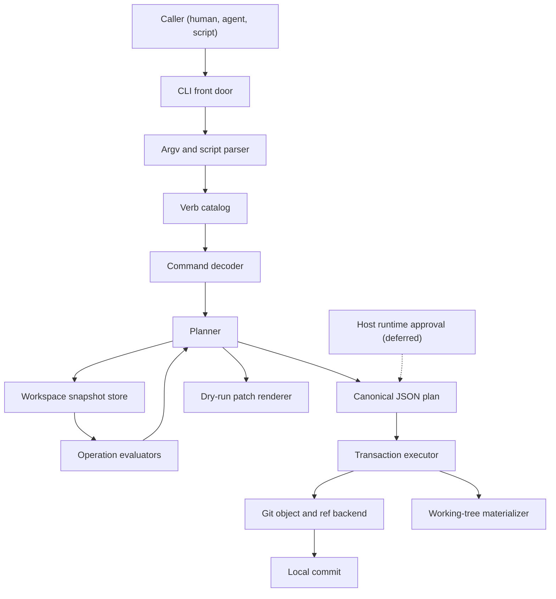

# etch — Design

> Status: v0, in progress. Captures decisions made through initial design discussion. Verb surface and error taxonomy are explicitly deferred.

## 1. What etch is

A small CLI for **mechanical mutations to text and data files**, where each successful mutating invocation becomes a git commit by default. Operations are atomic (per op) and transactional (per invocation): all the operations in one mutating invocation either land as a single commit or none of them do.

The primary audience is agentic coding tools operating against git-backed wiki-style repositories — multiple agents and humans iterating forward, where git history is the transaction log and mechanical edits ("set this frontmatter field," "replace this markdown section," "delete this JSON key") are common enough that doing them through a general-purpose patch tool burns tokens and risks subtle errors. etch trades generality for precision: it knows about a small, fixed set of file formats and a small, fixed set of operations, and it does them quickly and predictably.

The headline product is a binary. There may eventually be a Go library underneath suitable for embedding; that question is deferred.

## 2. Mental model

Three principles:

1. **Commits are the default contract for mutating verbs.** A successful mutating etch invocation produces a commit unless the caller explicitly opts out with `--no-commit`, or targets untracked/non-git paths with `--untracked`. Read verbs are a separate class: they print results and never commit. The default remains that the commit is the whole point.

2. **The script line and the CLI argv are the same thing.** A line in an etch script is the same tokens you'd type at the shell, modulo the binary name. This symmetry is the primary ergonomic property. It means agents can prototype on the command line and concatenate script files without translation, and it means the help page documents both surfaces simultaneously.

3. **No escape hatches inside the DSL.** The script syntax has no variables, no expansions, no subshells, no pipes, no conditionals. Composition happens at the shell level, *outside* etch. This keeps etch's own blast radius statically bounded and makes it a narrow permission target.

## 3. Invocation surface

Verb-first, with a small set of top-level flags.

```
etch <verb> [args...]                  one-shot
etch run <script>                      multi-op transaction from script
etch --plan <verb> [args...]           emit JSON plan, do not execute
etch --plan run <script>               emit JSON plan for batch
etch --dry-run <verb> [args...]        emit git-am-compatible patch
etch help [verb]                       human-readable help
etch verbs --json                      machine-readable verb catalog
etch --help                            terse one-screen reference
```

For `run`, `<script>` is a path to an etch script. The conventional path `-` means stdin.

Top-level flags:

| Flag | Env | Effect |
|---|---|---|
| `--plan` | — | Emit JSON plan to stdout, do not write or commit. |
| `--dry-run` | — | Emit git-am-compatible patch to stdout, do not write or commit. |
| `--no-commit` | — | Apply changes to working tree, skip commit. |
| `--no-checkout` | — | After committing, do not materialize touched paths into the working tree. Invalid with `--no-commit`. |
| `--untracked` | `ETCH_UNTRACKED=1` | Permit target paths that are not tracked by git. Outside a git repo, run as a pure working-tree mutator. |
| `--message <m>` | — | Override auto-generated commit message. Invalid with `--no-commit`. |
| `--message-prefix <m>` | — | Prepend to auto-generated message. Invalid with `--no-commit`. |
| `--message-suffix <m>` | — | Append to auto-generated message. Invalid with `--no-commit`. |
| `--retries <n>` | — | Retry budget on optimistic-concurrency conflict. `-1` = retry forever. Default `3`. |
| `--allow-empty` | — | Permit a commit with no content change. Invalid with `--no-commit`. |

`--plan`, `--dry-run`, and `--no-commit` are mutually exclusive. The first two skip execution entirely; the third writes but doesn't commit. `--no-checkout` applies only to successful committing invocations; it has no meaning with `--plan`, `--dry-run`, or `--no-commit`. Read verbs do not accept mutation or commit-control flags, because they have no write, plan, commit, or materialization phase.

Inside a git repo, `--untracked` permits existing untracked target paths to participate in the transaction; those paths can become tracked if the invocation commits. Outside a git repo, `--untracked` implies pure mutation with no commit, so commit-message flags, `--allow-empty`, and `--no-checkout` are invalid.

## 4. Script syntax

A script is a sequence of lines. Each line is either blank, a comment (starts with `#`), or a statement. A statement is the same token sequence that follows `etch` on the command line, tokenized using shell single-quote, double-quote, and backslash-escape rules. There are no expansions of any kind — `$FOO` is a literal four-character string.

Multi-line values use heredocs with the same syntax shell uses, but heredocs are an etch-level construct (not delegated to a shell parser) and are the only multi-line affordance:

```
# Set a scalar
set posts/hello.md frontmatter.title "Hello, world"

# JSON literal as a single argument
set posts/hello.md frontmatter.tags '["draft","intro"]'

# Multi-line content via heredoc
replace-section posts/hello.md "## Summary" <<EOF
This post introduces the project and its goals.
EOF

# Delete a key
delete posts/hello.md frontmatter.draft
```

Statement shapes are regular, but not literally fixed at three arguments. The common mutating shape is `verb path selector value`; read verbs often omit `value`; file verbs may have two paths; plumbing commands add a format namespace before the verb. Where a command needs additional knobs, they are flags (`--depth=2`), not positional surprises. If a command cannot be summarized compactly in the help table, the command is wrong.

### Why this and not the alternatives

A decision matrix considered six options against ten criteria (LLM correctness, CLI/script symmetry, multi-line value ergonomics, parse error locality, implementation surface, quoting pit count, shell composability, familiarity, doc density, auditability). The chosen option (shell-quoted argv lines) scored highest by a wide margin. The two key disqualifiers for embedded shell (e.g., via `mvdan/sh`) were:

- **Auditability.** Embedded shell has command substitution and expansion, so a static enumeration of "what will this script do" requires evaluation, and even then can reach outside the etch operation set entirely. That breaks the authorization story.
- **Quoting pit count.** Inheriting shell's expansion rules means inheriting its quoting traps, which are the #1 LLM failure mode in scripted-tool tasks.

JSON, S-expression, Tcl-like, and bespoke-DSL alternatives were ruled out (CLI/script asymmetry, familiarity cost, or implementation overhead with no offsetting benefit).

## 5. Verbs

Two tiers:

**Porcelain** verbs infer file format from path extension (`.md` → markdown-with-optional-frontmatter, `.json` → json, `.yaml`/`.yml` → yaml). They cover the common cases and are what most scripts use.

**Plumbing** commands are format-explicit subcommands (`json set`, `yaml set`, `frontmatter set`, `md replace-section`). They have no inference and no surprises, suitable for scripts where the file extension might lie or where the porcelain heuristics would pick the wrong format.

The MVP verb surface is constrained by §3 (regular command shapes) and §10 (must fit in a dense help page). Verbs fall into two semantic classes:

- **Mutating verbs** compute new file contents. They may internally read one or more paths, but their user-visible effect is the plan/commit/materialization pipeline.
- **Read verbs** print information to stdout and have no write, plan, commit, or materialization phase. In MVP, `run` accepts mutating verbs only; mixed read/write scripts and batched read-only scripts are deferred.

### Selector syntax

Structured data selectors are paths, not programs. For JSON, YAML, and YAML frontmatter, etch selectors are a subset of RFC 9535 JSONPath singular queries: they can identify at most one node and exclude wildcards, recursive descent, slices, filters, unions, and function extensions. This gives etch a standard selector grammar without importing JSONPath's full query language.

- `$.agents.assistant.last_run` for ordinary object fields.
- `$.items[0].title` for array indexes if indexes are admitted in MVP.
- `$["key.with.dots"]` for keys that cannot be represented as plain dotted segments.

Verbs treat a zero-match selector according to the verb: `set` may create a missing final object member, while `delete`, `get`, and `append` require the selected target to exist unless a verb says otherwise. Syntax that can produce multiple matches is rejected before evaluation.

JSON Pointer was considered because it is standardized and unambiguous, but `/agents/assistant/last_run` is less natural at the CLI and composes poorly with Markdown part selectors. Full JSONPath was considered because it is standardized and familiar, but wildcard/predicate/multi-match behavior is the wrong default for single-target mutation. Full `jq` was considered because its path syntax is good, but its execution model is far broader than etch's mutation contract.

### Markdown parts

Markdown files have several addressable parts: YAML frontmatter, section bodies, task list items, pipe tables, and Obsidian Dataview-style fields. In porcelain Markdown commands, `frontmatter` is a selector namespace, not a variable. `set task.md frontmatter.status complete` means "within this Markdown file, mutate the YAML frontmatter field `status`." The structured selector inside that part is still normalized as JSONPath (`$.status`) in plans.

Alternatives considered:

- **Implicit frontmatter for Markdown paths.** Shorter, but blocks body-level fields with the same names and makes `set task.md status complete` ambiguous.
- **Separate porcelain verbs only.** `frontmatter set task.md status complete` is explicit but loses the convenient format-inferred `set path selector value` shape.
- **Virtual YAML file model.** Treat frontmatter as a hidden YAML document adjacent to the Markdown body. Accurate internally, but awkward to explain at the CLI.

The resulting rule: porcelain Markdown selectors may use explicit part prefixes such as `frontmatter.*` for CLI ergonomics; canonical plans store the Markdown part and normalized structured selector separately. Plumbing commands can use namespaces instead (`frontmatter set <path> <selector> <value>`), where `<selector>` is already relative to that part.

### Mutating surface

| Format | Verbs | Selector/value behavior |
|---|---|---|
| JSON | `set`, `delete`, `append` | Selectors use the JSONPath subset above. `set` creates a missing leaf and missing object containers; it fails if an intermediate component exists but is not an object. Values are parsed as JSON when they are valid JSON literals, otherwise treated as strings. `delete` removes an existing key. `append` requires the selector to name an array and appends the parsed value. |
| YAML | `set`, `delete`, `append` | Same selector and value semantics as JSON, but using a round-tripping YAML representation so comments, key order, indentation style, and scalar spelling are preserved where the parser can preserve them. |
| Markdown frontmatter | `set`, `delete`, `append` | Selectors under `frontmatter.*` operate on YAML frontmatter using the YAML rules above. If a Markdown file has no frontmatter, `set frontmatter.*` creates a frontmatter block; `delete` and `append` require an existing block. |
| Markdown body | `replace-section` | The selector is a heading line such as `## Notes`. Replacement covers the content under that heading up to the next heading of equal or higher level. Missing or ambiguous headings are errors. |
| Files | `create`, `rm`, `mv`, `cp` | File-level verbs borrow familiar Unix names where the operation is truly the same shape, but etch does not inherit shell globbing, recursive deletion, or arbitrary flags. Signatures are `create <path> <content>`, `rm <path>`, `mv <src> <dst>`, and `cp <src> <dst>`. `create` and `cp` fail if the destination exists. `rm` fails if the path is absent. `mv` fails if the source is absent or destination exists. |

Deferred mutating operations include list `prepend`, `insert`, and value-based `remove`; Markdown `append-section`, `prepend-section`, `delete-section`, `move-section`, and `split-section`; and cross-file transforms that read from one location and write/remove/insert elsewhere. These are still mutating verbs, not read verbs, because their contract is new file contents rather than stdout.

### Markdown conventions to design early

Markdown is not just prose in the target repositories. The early Markdown surface needs explicit conventions for:

- **Sections.** ATX headings are stable anchors. Section selectors should support exact heading text first, then consider disambiguators for repeated headings.
- **Tasks.** GitHub-style task list items (`- [ ]` / `- [x]`) need verbs for completion and metadata updates. Candidate commands: `task complete <path> <task-selector>` and `task set <path> <task-selector> <field> <value>`.
- **Inline fields.** Obsidian Dataview-style fields such as `[due:: 2026-03-01]` should be considered first-class Markdown data. Candidate commands: `field set <path> <field-selector> <value>`, `field delete <path> <field-selector>`, and `field get <path> <field-selector>`.
- **Tables.** Markdown pipe tables and CSV files likely share a table mutation model: set cell, append row, delete row, and maybe upsert row by key column. Table selectors need a way to identify the table, row, and column without relying on brittle line numbers.

These commands need a separate selector design pass before they graduate into the MVP table above.

Initial read verbs are `get`, `exists`, and `keys` for JSON/YAML/frontmatter paths, plus `get-section` and `list-sections` for Markdown bodies. They print to stdout, never commit, and exist mainly for scripting symmetry, tests, and shell composition.

Each mutating verb is annotated as idempotent or non-idempotent in the help table. Idempotent ops that produce no content change are no-ops and don't contribute to the commit; non-idempotent ops (`append`) always produce changes. Read verbs are explicitly marked read-only and are outside the plan/commit machinery described below.

## 6. Plans

A **plan** is etch's structured answer to "if I were to run this mutating invocation, what exactly would happen — every byte that would change, in what file, ending in which commit?" It is produced by the same code path as actual execution, stopped one step before side effects. Same parser, same operation evaluator, same commit-tree builder — everything except writing objects, updating the ref, and materializing touched paths into the checkout. The plan cannot drift from reality because it *is* reality minus the side effects. Read verbs have no plan form in MVP.

The canonical plan format is JSON. It is the machine contract for hashing, authorization caches, tests, and host integrations. It should not be replaced by a prose or email-shaped format, because plan identity depends on stable parsing, canonicalization, and versioning.

Human preview is a separate surface. `--dry-run` lowers the semantic JSON plan to a base-locked mailbox patch compatible with `git am`, following `git format-patch` conventions: metadata headers, commit-message block, a three-dash separator, diffstat, and patch hunks. It is optimized for review and mechanical replay, not for canonical plan identity.

### Plan contents

```json
{
  "etch_plan_version": 1,
  "ref": "refs/heads/main",
  "base_commit": "a1b2c3...",
  "operations": [
    {
      "verb": "set",
      "target": {
        "path": "posts/hello.md",
        "part": "frontmatter",
        "selector": "$.title"
      },
      "value_sha256": "5d41402a..."
    },
    {
      "verb": "replace-section",
      "target": {
        "path": "posts/hello.md",
        "part": "body",
        "section": "## Summary"
      },
      "value_sha256": "9f86d081..."
    }
  ],
  "files": {
    "posts/hello.md": {
      "before_sha256": "e3b0c442...",
      "after_sha256": "84983e44..."
    }
  },
  "tree": "7f4e8d...",
  "commit": {
    "message": "etch: 2 changes in posts/hello.md\n\nChanges:\n- set posts/hello.md frontmatter.title \"Hello, world\"\n- replace-section posts/hello.md \"## Summary\" \"A tighter summary.\""
  }
}
```

All operation values are stored as `value_sha256` (no inline values) for uniformity and small plan size. Commit messages may contain bounded value previews, but the actual content is recoverable from the file's before/after states when needed for display.

### Dry-run preview

`--dry-run` renders the plan as a reviewable patch message rather than canonical JSON. It is a lowered artifact: applying it replays the already-computed byte-level change against the planned base, but it does not re-run etch's semantic selectors, validation, retries, or materialization logic.

The output follows `git am`'s mailbox conventions:

- The first `From <oid> Mon Sep 17 00:00:00 2001` line is the mbox delimiter, not commit metadata. etch uses the zero object ID there, following `git format-patch --zero-commit`; plan identity lives in `Etch-Plan-Hash`.
- The mail `Subject:` is the commit-message subject. etch should not wrap it in `[PATCH]` or `[ETCH PLAN]`, because `git am` strips common `[PATCH ...]` prefixes.
- The body before the first three-dash line (`---`), `diff -`, or `Index:` line becomes the commit-message body.
- Everything after the first three-dash line is patch input or patch commentary, not commit-message text.
- `Etch-*` lines live in the mail header block. They are for etch-aware readers, not commit-message trailers, and should not appear in `git log`.
- The `From:` and `Date:` mail headers carry the planned author identity and author date for `git am`.
- The applying committer identity and committer date come from the `git am` environment and options, so `git am` compatibility promises the same tree, commit message, and author metadata, not the same commit OID.

When a planned change can be represented as a Git patch, `--dry-run` output should be compatible with `git am`. The exact text is not part of the plan hash, but it should be stable enough for snapshot tests and easy human review:

```text
From 0000000000000000000000000000000000000000 Mon Sep 17 00:00:00 2001
From: <author-name> <author-email>
Date: <author-date>
Subject: etch set posts/hello.md frontmatter.title "Hello, world"
Etch-Plan-Hash: sha256:<hex>
Etch-Base-Commit: a1b2c3...
Etch-Tree: 7f4e8d...

---
 posts/hello.md | 2 +-
 1 file changed, 1 insertion(+), 1 deletion(-)

diff --git a/posts/hello.md b/posts/hello.md
...
```

The commit-message portion before `---` is exactly the generated commit message from §8. A multi-op plan's `Changes:` body therefore appears before `---`. After `---`, etch emits the diffstat and patch hunks. It does not embed the original command or script in the dry-run output; the generated commit message plus the patch hunks are the review surface, and the JSON plan is the canonical semantic record.

For a multi-op `run`, the generated commit body appears before `---`:

```text
From 0000000000000000000000000000000000000000 Mon Sep 17 00:00:00 2001
From: <author-name> <author-email>
Date: <author-date>
Subject: etch: 2 changes in posts/hello.md
Etch-Plan-Hash: sha256:<hex>
Etch-Base-Commit: a1b2c3...
Etch-Tree: 7f4e8d...

Changes:
- set posts/hello.md frontmatter.title "Hello, world"
- replace-section posts/hello.md "## Summary" "A tighter summary."

---
 posts/hello.md | 6 +++---

diff --git a/posts/hello.md b/posts/hello.md
...
```

If a future operation cannot be represented as a `git am`-compatible patch, `--dry-run` must either report that limitation or use an explicitly different format marker. Silent fallback to a non-applicable lookalike is not allowed.

### Canonicalization & hashing

Plans are serialized using JCS (RFC 8785): sorted keys, no whitespace, escaped consistently. The plan hash is SHA-256 of the canonical bytes. Two implementations of the canonicalizer agree byte-for-byte.

### What's in the hash, and why

- **Operations** anchor to user intent.
- **Per-file before/after sha256** anchors to both input state and computed output. A change in etch's *behavior* (a verb's semantics changed across versions) invalidates plans even when operations look textually identical, because the after-hashes differ. This means a runtime caching "I approved hash H" doesn't also need to track etch versions.
- **Base commit** pins to a point in history; if HEAD has moved, the plan is stale.
- **Tree OID** is the strongest possible "what would actually land" anchor — two plans with the same tree OID produce byte-identical commits.
- **Commit metadata** captures message and author. Author/timestamp are normalized during planning unless `GIT_AUTHOR_DATE`/`GIT_COMMITTER_DATE` are set.

### Plans drive both audit and execution

A plan serves three purposes from one structure:

1. **Audit record** for runtimes rendering "here's what will happen" to humans.
2. **Auth-cache key.** Hash a plan, cache the user's approval against the hash; reuse approval iff the same plan recomputes to the same hash.
3. **STM transaction record.** See §7.

## 7. Execution model & concurrency

etch executes optimistically and uses git's existing CAS primitives to detect conflict.

### Per-transaction temp index

Every mutating invocation creates a temp index (`GIT_INDEX_FILE` set to a tempfile) initialized from `HEAD^{tree}` (or the empty tree for an unborn branch), not by copying the user's live index. etch writes candidate blobs for touched paths into that temp index, builds a tree, creates the commit object, and updates the ref. The user's live index is never used to build the transaction, and unrelated staged or unstaged changes are invisible to etch.

### Working-tree materialization

After a successful ref update, etch materializes touched paths into the caller's working tree by default. Materialization is a checkout phase, not part of commit construction: it updates the working tree and live index entries for touched paths only so they match the committed tree. Unrelated paths are not touched.

`--no-checkout` skips this phase. It is useful for agent workflows that care only about the commit graph and do not need the shared checkout to reflect the new commit immediately.

If materialization cannot safely update a touched path because it changed after validation, the commit remains in history and etch reports a materialization failure. The transaction's durability boundary is the ref update; checkout is the post-commit synchronization step.

### The two CAS checks

1. **Read-set validation.** The plan records `before_sha256` for every file etch read. At execution time, etch re-hashes those files; if any differ, the transaction aborts. This is the read-set check from optimistic STM — the transaction is valid iff its inputs haven't been invalidated.
2. **Ref CAS.** etch updates the ref using the old-value form (`update-ref <ref> <new> <old-expected>`), where old-expected is the plan's `base_commit`. If another writer committed to the ref between plan and execution, this fails atomically.

Both checks are necessary. Read-set validation prevents stale computation when other writers have edited the working tree without committing. Ref CAS prevents losing concurrent commits when other writers have committed without touching our files.

### Retry policy

On either CAS failure, etch re-plans from the latest observed state and tries again. Retries are bounded by `--retries` (default 3, `-1` = forever). Backoff strategy is an implementation detail (likely exponential with jitter, capped). Retry is internal and invisible to the caller in the success case.

### Pinned execution is deferred

Plan hashes are useful for external approval caches: a host can present a plan, remember that the user approved hash H, and later ask etch to execute only if the recomputed plan still hashes to H. That prevents a time-of-check/time-of-use gap where the approved command text is the same but the file contents, branch head, commit message, or etch behavior changed.

That said, pinned execution is not required for the standalone CLI MVP. The MVP exposes stable plan hashes but defers the execution flag (for example, `--require-plan-hash <hex>`) until there is a concrete host-runtime integration that needs it.

## 8. Commits

Every successful mutating etch invocation produces exactly one commit by default (or zero, if all operations were idempotent no-ops and `--allow-empty` was not passed). `--no-commit` is the explicit escape hatch for "apply, but do not record a commit." Read verbs never create commits.

### Auto-generated messages

The default commit message is generated from normalized operation descriptors. These descriptors are script-shaped and may include bounded value previews for operations whose main effect is writing a value. They never include unbounded raw payloads; full values live in file contents and are represented in plans by `value_sha256`.

Descriptor shape is `<verb> <path> <selector> [<value-preview>]`, adjusted for verbs without selectors or values.

Value previews are deterministic:

- Values are previewed after parsing, not from raw argv spelling. JSON/YAML/frontmatter values render as compact JSON. Markdown body text renders as a JSON string after line-ending normalization.
- Exact previews are allowed only for single-line UTF-8 values whose rendered preview is at most 80 characters.
- Longer or multi-line UTF-8 values render with `...` truncation only. For strings, the ellipsis lives inside the JSON string (`"prefix..."`). For objects and arrays, the compact JSON rendering is cut on a character boundary and ends with `...`; truncated previews are not required to be parseable JSON.
- Non-UTF-8 values render as `<binary, N bytes>`.
- Value previews should fit within 80 characters. If a descriptor would exceed 120 characters, the preview budget is reduced so the descriptor fits; if the target alone consumes the line budget, the value preview is omitted from that descriptor.
- Single-op subjects include an exact value preview only if the full subject fits on one line within 72 characters. Otherwise the subject omits the value and the body contains `Value: <value-preview>`.
- Commit messages do not include value hashes. Hashes are plan metadata; commit-message values are human previews.

- Single op with a short value: subject only, `etch <verb> <path> <selector> <value-preview>` (e.g., `etch set posts/hello.md frontmatter.title "Hello, world"`).
- Single op without a value preview in the subject: subject `etch <verb> <path> <selector>`, with a body containing `Value: <value-preview>` when the operation has a value.
- Multi-op in one file: subject `etch: N changes in <path>`, with a body headed `Changes:` and one descriptor per operation.
- Multi-op across files: subject `etch: N changes across M files`, with the same `Changes:` body.

Example multi-op message:

```text
etch: 2 changes in posts/hello.md

Changes:
- set posts/hello.md frontmatter.title "Hello, world"
- replace-section posts/hello.md "## Summary" "A tighter summary."
```

Example long-value message:

```text
etch set posts/hello.md frontmatter.summary

Value: "This summary is long enough that it needs a bounded preview..."
```

`--message` overrides entirely. `--message-prefix` and `--message-suffix` compose with the auto-generated message. Configurable templates are deferred.

### Idempotency and the empty-commit case

Operations that produce no content change contribute nothing to the commit. If every op is a no-op, no commit is created and etch exits 0 with a `nothing to do` notice on stderr. `--allow-empty` forces an empty commit in the rare case where this is desired.

### Working-tree state of touched files

If a file etch is targeting differs between `HEAD`, the index, and the working tree, etch reads the working-tree state, applies operations to it, and commits that result by default. The working tree wins over the index for touched paths; unrelated staged changes are not pulled into the etch commit. After the commit lands, default materialization updates the touched working-tree files and index entries to the committed content. Under `--no-commit`, no commit is created; etch rewrites the file in place and leaves the result dirty. Other dirty files are unaffected. Rationale: agents shouldn't have to negotiate with human staging.

## 9. Security model

The threat model: an LLM-driven agent generates etch invocations. The user wants to grant blanket permission ("always allow `etch` on this repo") once, without that grant becoming equivalent to "always allow shell."

### Intrinsic capability bounds (MVP, non-negotiable)

- **No network.** etch makes no network calls.
- **No process spawning.** etch does not exec anything except git for the strict subset of operations it needs (read refs, write objects, update refs).
- **No filesystem escape.** etch reads and writes only within the active root: the git repository by default, or CWD when `--untracked` is operating outside git. No symlink chasing past the active root.
- **No DSL escape hatch.** §4 — the script syntax has no expansion, no subshells, no exec.

These properties are intended to make etch a narrow capability. They are not, by themselves, enough to claim that every host can safely allow a broad shell rule such as `etch *` or `Bash(etch:*)`.

The hard case is host permission matching. Some agents approve commands by executable name, some by shell command prefix, some by glob-like patterns, and some run commands in a sandbox rather than a command allow-list. A broad rule also admits etch's own wider-scope modes such as `--untracked`, unless the host can reliably deny or separately prompt for that argument. Therefore, the security claim for MVP is:

> etch's default repo-scoped mode is designed to be safe to grant directly. Blanket shell allow-list guidance is deferred until tested against the permission models of target hosts.

### Plan as authorization primitive (deferred)

A runtime can compute `etch --plan <args...>`, render the JSON to a human, hash it, cache the approval, and later execute only if the same plan would result. The execution pin is deferred, but the plan format should remain suitable for this use.

### Auth protocol on stdio (out of scope)

An interactive `AUTH-REQUEST`/`AUTH-GRANT` protocol on stdio was considered and rejected — it leaks runtime concerns into etch and competes with whatever the host runtime already does. Etch instead exposes structured exit info that runtimes can drive themselves.

## 10. Documentation surfaces

Three layers, designed so an agent can load the entire feature set in a small token budget:

| Surface | Audience | Budget |
|---|---|---|
| `etch --help` | agents that already know CLIs | ~400 tokens |
| `etch help` / `man etch` | humans, agents needing examples | ~1500 tokens |
| `etch verbs --json` | runtimes building allow-lists | machine-readable |

The verb table is the bulk of the help. It's strictly tabular: name, signature, one-line description, idempotent Y/N. Deviations get one line of prose, not a section. The discipline is enforced by writing the help page first when designing each verb — if it doesn't fit, the verb is wrong (§5).

## 11. Exit codes

- `0` — success.
- `1` — operation failed.
- `2` — usage error (unknown flag, malformed argv).

MVP should not allocate a large taxonomy up front. Add distinct exit codes only when callers have a distinct automated response. For example, retry-budget exhaustion may eventually deserve a separate code if callers should retry later, while "selector not found" and "target file missing" can both be ordinary operation failures for a human-facing CLI.

## 12. Configuration

Environment variables:

| Var | Effect |
|---|---|
| `ETCH_UNTRACKED` | Same as `--untracked`. |
| `GIT_AUTHOR_DATE`, `GIT_COMMITTER_DATE` | Standard git semantics; used in commits and plan hashes. |
| `GIT_AUTHOR_NAME`, `GIT_AUTHOR_EMAIL` | Standard git semantics. |

No custom config file in MVP.

## 13. Non-goals

- **Generic text editing.** Use `sed`, `awk`, `sd`. etch is for *structural* mutations on known formats.
- **Turing-complete scripting.** Use a real language and shell out to etch.
- **Semantic conflict resolution.** etch does not understand user intent well enough to merge competing semantic edits. Working-tree synchronization may still use ordinary text conflict markers if that proves to be the best agent-facing failure mode.
- **Network operations.** No `git push`, no `git pull`. The "git side effect" is local commits only.
- **Authorization UX.** Surfaces (plan format, exit codes) are provided; the UX is the host runtime's job.

## 14. Open questions

- **Selector grammar.** Finalize the exact RFC 9535 JSONPath subset, including quoted segments, escaping, and whether array indexes are in MVP.
- **Markdown tables and CSV.** Whether Markdown pipe tables and CSV should share one table selector/mutation model in MVP.
- **Permission-model research.** Test Codex, Claude Code, Cursor, and other target hosts before documenting any blanket shell allow-list rule. In particular, decide whether `--untracked` must move behind a separate permission surface.
- **Exit-code splits.** Whether retry exhaustion or materialization failure needs a distinct code because callers can do something useful with it.
- **Ref scope.** HEAD-only in MVP; `--ref refs/heads/<branch>` for non-checked-out branches is plausible but adds complexity.
- **Backoff strategy.** Implementation detail, not in spec.
- **Plan inline values.** Plan values are always hashed for uniformity. May reconsider if plans become hard to read.
- **Materialization failures.** Exact exit code and stderr shape when the commit succeeds but post-commit checkout of touched paths fails.
- **Working-tree conflict materialization.** Whether post-commit materialization should fail cleanly when a touched path changed after validation, or attempt a three-way text merge and leave conflict markers in the working tree when it cannot merge automatically. Agents already need to cope with conflict markers, so this may be a better recovery surface than refusing to update the checkout.

## 15. Architecture

etch is a thin command surface around a deterministic planning and execution core. The core accepts normalized operations, obtains bounded workspace snapshots through one store abstraction, computes byte-level results, and then either renders a plan/patch or commits the planned tree through git.



The architecture has one important shape constraint: semantic mutation happens before git side effects. Parsing, selector evaluation, format rewriting, plan hashing, patch rendering, and execution all share the same normalized operation model, so preview and execution cannot become separate interpretations of the same command.

### CLI front door

The CLI front door owns top-level flag parsing, env-var defaults, command dispatch, and the split between one-shot invocation, `run`, help, verb catalog, plan, dry-run, no-commit, and committing execution. It also enforces global flag incompatibilities before any file reads.

Dependency posture: use `urfave/cli/v3` for top-level command, flag, help, and environment-variable behavior. The Go standard library flag parser follows older Plan 9-style conventions and is the wrong user-facing surface for a modern CLI. etch still keeps verb decoding in project code so the catalog remains the source of truth for argv, scripts, help, and `verbs --json`. The `urfave/cli` boundary must stop before verb operands, for example with root `StopOnNthArg=1`, so values beginning with `-` remain etch arguments rather than being consumed as top-level flags.

### Argv and script parser

The parser turns either process argv or script lines into the same token stream. Script parsing supports comments, blank lines, shell-style quotes/backslash escaping, and etch-level heredocs, but no variable expansion, command substitution, globbing, process execution, pipes, or conditionals.

Dependency posture: implement this parser directly. General shell parsers are intentionally too expressive for etch's security model, and the grammar is small enough that a hand-written tokenizer should be easier to audit and test.

### Verb catalog

The verb catalog is the single source of truth for command names, command paths, signatures, format namespaces, read vs mutating classification, idempotency, selector/value expectations, one-line help text, and machine-readable `verbs --json` output. Execution dispatch should use this catalog rather than duplicating verb metadata in the parser, help renderer, and evaluator registration.

Catalog entries project into the CLI through a generic command decoder. Each entry declares its accepted token path (`set`, `json set`, `frontmatter set`), command class, allowed top-level flags, command-local flags, positional schema, selector namespace rules, evaluator ID, help row, and JSON catalog fields. The CLI resolves the longest matching token path, validates flags and arity from the entry, and emits either a normalized mutating operation or a read command. `run` uses the same resolver for each parsed statement, so a script line and process argv stay equivalent.

Verification plan: unit tests cover longest-match command resolution, command-local flag parsing, global flag admission/rejection by command class, positional arity errors, normalized operation output, `run` statement equivalence with direct argv, help-row generation, and `verbs --json` projection from the same catalog entries.

Dependency posture: no external dependency is expected. Keeping this as ordinary Go data makes the help and JSON catalog easy to snapshot.

### Selector engine

The selector engine parses and evaluates the singular JSONPath subset used for JSON, YAML, and frontmatter fields. It rejects any syntax that can produce multiple matches before evaluation, normalizes selectors for plans, and reports zero-match or type errors according to the verb's semantics.

Dependency posture: use `github.com/theory/jsonpath` as the recommended parser candidate. It targets RFC 9535, has no runtime dependencies, and exposes a stable `spec` AST surface. etch parses once, inspects `Path.Query().Segments()` and each segment's selectors, rejects descendants, selector lists with more than one selector, wildcards, slices, filters, function extensions, and disallowed indexes before evaluation, then adapter-walks only admitted `Name` and `Index` selectors. `github.com/speakeasy-api/jsonpath` was evaluated and is not recommended because its public surface is an evaluator over YAML nodes rather than an inspectable parser AST.

### Format adapters

Format adapters convert bytes into editable representations and back to bytes. JSON, YAML, Markdown/frontmatter, Markdown sections, future Markdown tables, and possible CSV support each live behind this boundary. Adapters are responsible for preserving formatting where the format contract requires it, especially YAML comments, key order, indentation, scalar spelling, and Markdown body text outside the addressed part.

Dependency posture: use `encoding/json/v2` for JSON if the selected Go toolchain supports it without unacceptable experiment flags, `goccy/go-yaml` for YAML, and `yuin/goldmark` with GFM extensions for Markdown. YAML uses parser/token/AST APIs for comments, key order, anchors, aliases, token positions, and generated snippets; etch owns selector evaluation and localized byte rewrites. Markdown uses goldmark for CommonMark/GFM structure, source segments, headings, task-list semantics, and table nodes; goldmark renderers are not used to rewrite Markdown source.

### Operation evaluators

Operation evaluators implement verbs against format adapters and selectors. They receive file snapshots from the planner, then produce new file bytes, operation descriptors, value hashes, no-op information, and structured errors. They do not read files, write files, update refs, or commit. Read verbs share parser/catalog/selector/adapter infrastructure but bypass the planning and commit pipeline.

Dependency posture: evaluators should be project code. Their contracts are etch's product semantics, not generic library behavior.

### Planner

The planner is the pure core for mutating invocations. It owns read-set construction, but it does not perform raw filesystem reads itself: it asks the workspace snapshot store for file content, path metadata, and base-ref state. It applies all operations atomically in memory, computes per-file before/after hashes, asks the git backend to build the planned tree, generates the commit message, and emits the canonical plan structure.

Dependency posture: plan hashes are computed over RFC 8785 JSON Canonicalization Scheme bytes. etch canonicalizes original UTF-8 JSON input bytes, not Go values produced by `encoding/json`. Inputs must satisfy the JCS/I-JSON domain: valid UTF-8, no duplicate object member names after escape decoding, no lone surrogates or noncharacters, and finite IEEE-754 binary64 numbers in the accepted range. Object members are sorted by RFC 8785 UTF-16 code-unit order, and canonical output is exact UTF-8 bytes with no trailing newline. The selected candidate is `github.com/lattice-substrate/json-canon/jcs`, pending etch integration fixtures and acceptance of its Go version/platform constraints. Hashing uses the Go standard library.

### Workspace snapshot store

The workspace snapshot store is the read boundary for planning and read verbs. It resolves paths against the active root, enforces tracked/untracked mode, rejects path traversal and symlink escapes, reads working-tree bytes for touched paths, records read-set hashes, and exposes base commit/tree information. It presents immutable snapshots to evaluators so retry planning starts from a fresh store view rather than mutating prior state.

Dependency posture: implement this boundary directly on top of filesystem and git backend primitives. The correctness work is in containment, tracked-path semantics, and read-set hashing, not in a generic file access abstraction.

### Patch renderer

The patch renderer lowers a plan to the `--dry-run` mailbox patch format. It owns the `From`, `Date`, `Subject`, `Etch-*` headers, diffstat, and hunks, and it must preserve the distinction between canonical plan identity and human review output.

Dependency posture: use native git output for MVP patch rendering. Standalone Go diff/patch libraries and `go-git` diff helpers were evaluated; none is selected as the `--dry-run` renderer. `github.com/bluekeyes/go-gitdiff` is the strongest support candidate for parsing, applying, or inspecting Git-shaped patches in fixtures, and `github.com/aymanbagabas/go-udiff` is the strongest future candidate for an in-process text hunk engine. Any replacement renderer must produce mailbox output with compatible metadata, diffstat, mode changes, creates/deletes, renames, stable path quoting, no-newline markers, binary patch payload/applicability, and hunks that apply cleanly with `git am` to the planned tree.

### Git backend

The git backend abstracts repository discovery, tracked/untracked checks, blob and tree construction, commit-object creation, ref reads, ref CAS updates, author metadata, and any fallback calls to the git executable. It is the only component allowed to perform git side effects.

The git backend requirements are:

- discover the active repository and current checked-out ref from an arbitrary CWD;
- read `HEAD`, unborn-branch state, refs, trees, blobs, and tracked-path status;
- build blobs, trees, and commit objects without using the caller's live index as the transaction state;
- support an isolated temp-index-equivalent transaction model;
- update refs with old-value CAS semantics equivalent to `git update-ref <ref> <new> <old>`;
- materialize only touched paths into the working tree and live index;
- preserve unrelated staged and unstaged changes;
- support author identity/date semantics compatible with git;
- produce or delegate `git am`-compatible patch output for `--dry-run`.

Dependency posture: use a native-git-first backend for MVP. `go-git` has useful read/object/ref primitives, including repository discovery, object access, and reference compare-and-set support, but it is not sufficient as the sole backend for etch's compatibility contract. Native git remains the reference for temp-index construction, exact `update-ref` old-value CAS, live-index materialization, and `git am`/`format-patch` output. Reconsider `go-git` later for an in-process read/object layer behind the same backend fixture suite.

### Transaction executor

The executor takes a planned mutation through validation, retries, commit creation, ref CAS, and post-commit materialization. It treats the ref update as the durability boundary: a materialization failure reports an error after the commit exists rather than pretending the transaction never happened.

Dependency posture: this should mostly compose the planner and git backend. Retry backoff can be implemented directly unless a dependency becomes useful for shared observability or cancellation later.

### Working-tree materializer

The materializer updates only touched paths in the working tree and live index after a successful commit. It must preserve unrelated staged and unstaged changes, refuse unsafe overwrites of touched paths that changed after validation, and support `--no-checkout` by being skipped entirely.

Dependency posture: use the git backend for index updates and checkout-like behavior where possible. Avoid a generic filesystem synchronization dependency; the update set is intentionally small and path-bounded.

### Security boundary

The security boundary enforces active-root containment, symlink refusal or containment, no network access, no process spawning outside the permitted git surface, and no DSL escape hatches. Host authorization hooks sit outside the MVP execution path but should attach to the plan boundary rather than to lower-level file writes.

Dependency posture: path validation should use standard filesystem/path primitives plus focused tests.

## 16. Dependency candidates and decisions

This section records dependency candidates, recommendations, explicit user selections, and evaluation work still needed. Final approval to add or vendor a dependency comes from Brandon.

| Area | Decision | Status | Rationale |
|---|---|---|---|
| Language/runtime | Go standard library | Baseline | Use for hashing, path handling, filesystem access, CSV parsing, process execution, and small data structures. Do not use `flag` for the user-facing CLI. |
| CLI framework | `github.com/urfave/cli/v3` | Selected, passthrough-gated | Supports modern command callbacks, typed/env-backed flags, subcommands, generated/custom help, and shell completion. Use a passthrough boundary such as root `StopOnNthArg=1`; keep etch's command decoder catalog-driven above it. |
| Script parsing | Hand-written tokenizer | Spec-selected | The grammar is intentionally smaller than shell; no expansion or execution semantics should be imported. |
| Embedded shell parsing | `mvdan/sh`-style shell parser | Rejected by spec | Shell syntax was evaluated and rejected because command substitution, expansion, and broader shell semantics break auditability. |
| Verb catalog | Plain Go catalog data | Spec-selected | The catalog should project to dispatch, help, and `verbs --json` without a schema/codegen dependency. |
| Selector parsing | `github.com/theory/jsonpath` | Recommended candidate | RFC 9535 implementation with no runtime dependencies and stable `spec` AST surface. Etch can reject non-singular syntax before evaluation, then adapter-walk admitted selectors. |
| Selector parsing | `github.com/speakeasy-api/jsonpath` | Evaluated, not recommended | Public API is a YAML-node evaluator with private AST. Its tokenizer is not enough of a parser-only validation surface for etch's singular selector contract. |
| JSON | `encoding/json/v2` | Brandon-selected with toolchain caveat | Prefer v2 semantics for stricter JSON behavior and deterministic output options. Confirm target Go version and `GOEXPERIMENT=jsonv2` status before implementation. |
| CSV | `encoding/csv` | Candidate if CSV enters MVP | CSV is standard-library covered; table selector semantics are still deferred. |
| YAML | `github.com/goccy/go-yaml` | Selected, fixture-gated | Use parser/token/AST APIs for comments, key order, anchors, aliases, token positions, and generated YAML snippets. Etch owns selector evaluation and localized byte rewrites; whole-document emission is allowed only where fixtures prove acceptable preservation. |
| Markdown | `github.com/yuin/goldmark` plus `extension.GFM` | Selected, parser-only | Use goldmark for CommonMark/GFM structure, source segments, headings, task-list semantics, and table nodes. Markdown adapters preserve untouched bytes by splicing original source ranges. |
| JCS canonicalization | `github.com/lattice-substrate/json-canon/jcs` | Selected candidate, fixture-gated | Best fit for plan hashing: byte-in/byte-out API, strict parser, duplicate-key rejection, UTF-16 key sorting, and broad conformance fixtures. Requires acceptance of Go version/platform constraints. |
| JCS canonicalization | `github.com/gowebpki/jcs` | Evaluated, not recommended | Usable byte-in/byte-out API, but parser behavior is too loose for etch plan hashes unless wrapped in a strict JSON/I-JSON validator. |
| JCS canonicalization | `github.com/ucarion/jcs` | Evaluated, not recommended | Canonicalizes Go values rather than original JSON bytes, so duplicate keys and input-domain violations can be lost before canonicalization. |
| JCS reference fixtures | `github.com/cyberphone/json-canonicalization` | Reference, not dependency | Upstream/reference source for JCS fixtures and provenance. The Go implementation is GOPATH-shaped and not the best etch dependency. |
| Git compatibility | System `git` executable | Reference implementation | Native git defines expected behavior for `git am`, ref CAS, object format, index updates, and checkout semantics. |
| Git in-process backend | `github.com/go-git/go-git/v6` | Evaluated, deferred for MVP primary backend | Strong read/object/ref primitives, but not sufficient as the sole backend for temp-index construction, exact `update-ref` CAS, live-index materialization, and `git am`/`format-patch` output. |
| Git diff/patch helpers | `github.com/go-git/go-git/v6` | Evaluated, not selected for `--dry-run` | Can compute tree/commit diffs and emit raw git-style unified text diffs, but lacks mailbox output, format-patch diffstat, binary patch payloads, stable path quoting, similarity/copy headers, and native hunk shape. |
| Diff/patch rendering | Git-generated patch output first | Spec-selected | `--dry-run` promises `git am` compatibility, so git's patch format is the reference surface. No in-process renderer is selected for MVP. |
| Git patch parser/helper | `github.com/bluekeyes/go-gitdiff` | Evaluated support candidate | Strongest non-git support library for parsing, formatting, and applying Git-shaped patch files, including modes, renames, copies, binary fragments, path quoting, and no-newline markers. It does not compute diffs, emit mailbox patches or diffstat, or perform full tree application. |
| Text hunk engine | `github.com/aymanbagabas/go-udiff` | Evaluated possible future candidate | Best standalone text hunk engine evaluated: maintained, Go-tools-derived, with unified output, no-newline handling, and patch-application tests. It does not provide the Git mailbox, diffstat, extended headers, mode/create/delete/rename, binary, or path-quoting surface etch needs for `--dry-run`. |
| Text diff libraries | `github.com/pkg/diff`, `github.com/hexops/gotextdiff`, `github.com/sourcegraph/go-diff-patch`, `github.com/sourcegraph/go-diff` | Evaluated, not selected | These provide bare unified diff generation, single-file patch generation, or unified-diff parsing/printing, but none covers etch's full git-am-compatible mailbox and tree-equivalence contract. |
| Retry/backoff | In-repo implementation | Spec-selected | The retry policy is small and should not pull in a dependency before observability or cancellation needs are clearer. |

## 17. Verification strategy

Verification is fully automated evidence that the implementation matches this spec. Product validation is separate: Brandon and users decide whether etch solves the right problem.

Most CLI behavior should be covered by snapshot tests over generated output:

- `--dry-run` snapshots use `git format-patch` output with etch metadata headers and are the primary golden surface for human-readable file mutation previews. For every representable dry-run fixture, tests should apply the output with `git am` in a temp repo at the planned base and assert the resulting tree OID matches the plan's tree. The same fixture should assert that `git am` creates the planned commit subject/body and author metadata, and that `Etch-*` headers do not appear in the commit log. Tests should not assert commit OID equality because committer metadata is supplied by the applying environment.
- `--plan` snapshots cover canonical JSON shape, redacted values, hashes, tree OIDs, and commit messages. Commit-message fixtures should cover exact value previews, ellipsis truncation, descriptor line budgets, and single-op subject/body fallback. Tests should also verify canonical plan bytes and plan hash stability.
- Successful commit tests compare `git show --stat --patch --format=fuller HEAD` against snapshots, with author and dates normalized by environment.
- `--no-commit` and `--no-checkout` tests assert working tree, live index, and `HEAD` state separately.
- Script tests cover tokenization, quoting, comments, heredocs, stdin via `run -`, and failure atomicity across multi-op runs.
- Format tests cover JSON, YAML, frontmatter, Markdown sections, Markdown fields/tasks/tables as they land, and CSV if admitted.
- Concurrency tests use multiple temp indexes and explicit ref CAS races to prove disjoint-path retry, same-path conflict behavior, and retry-budget exhaustion.
- Security tests cover path traversal, symlink escapes, absolute paths, untracked-path handling, outside-git behavior, and refusal to spawn non-git processes.

Unit tests should carry the parser, selector evaluator, format round-trippers, and commit-tree builder. End-to-end tests should prefer real temporary git repositories so the snapshots exercise the same object and ref behavior users get.

## 18. Validation strategy

Validation asks whether etch reduces agent work enough to justify its own command surface. It is measured with repeatable benchmark tasks, but interpreted as a product question: the numbers inform Brandon and users rather than defining pass/fail correctness.

Validation should compare at least these workflows:

- baseline agent edits using ordinary file reads, patch generation, and shell/git commands;
- etch one-shot invocations for single structural changes;
- etch `run` scripts for multi-file or multi-operation changes;
- etch dry-run/plan review followed by execution;
- recovery flows for dirty worktrees, changed touched paths, and conflict-marker materialization if admitted.

For each workflow, run a fixed task suite across representative repositories and file shapes:

- JSON field set/delete/append operations on small and large files;
- YAML frontmatter and standalone YAML updates with comments, anchors, aliases, and ordering;
- Markdown section replacement, frontmatter edits, task/list edits, and GFM table edits if admitted;
- mixed multi-file changes that touch disjoint files, same files, dirty files, and concurrent branches;
- negative cases where etch should refuse the operation and the agent must recover.

The benchmark harness should invoke several target agents in fresh sessions with the same task prompt, repository fixture, and success criteria. It should record wall-clock time, tool-call count, model input tokens, model output tokens, total tokens, retry count, generated patch size, final diff size, whether the task succeeded without human help, and whether the final repository state matches the expected tree. Token counts should come from host/provider usage metadata when available; otherwise the harness should use a documented tokenizer approximation and mark those runs as estimated.

Validation reports should present distributions, not single runs: median, p90, and failure rate per task family and workflow. A result is product-positive when etch reduces total tokens and elapsed time without increasing failure rate, review burden, or repair complexity. Cases where etch saves tokens but produces confusing review surfaces should be treated as validation failures even if verification passes.

## 19. Implementation notes

- Language: Go.
- Module: `github.com/brandonbloom/etch`.
- git operations: use the dependency decisions in §16; native git behavior is the compatibility reference.
- Parser: hand-written tokenizer for the script DSL. ~200 lines target.
- Plan canonicalization: use `github.com/lattice-substrate/json-canon/jcs` if etch integration fixtures confirm byte-equivalence and platform/toolchain fit; otherwise fall back to a small in-repo JCS implementation.
